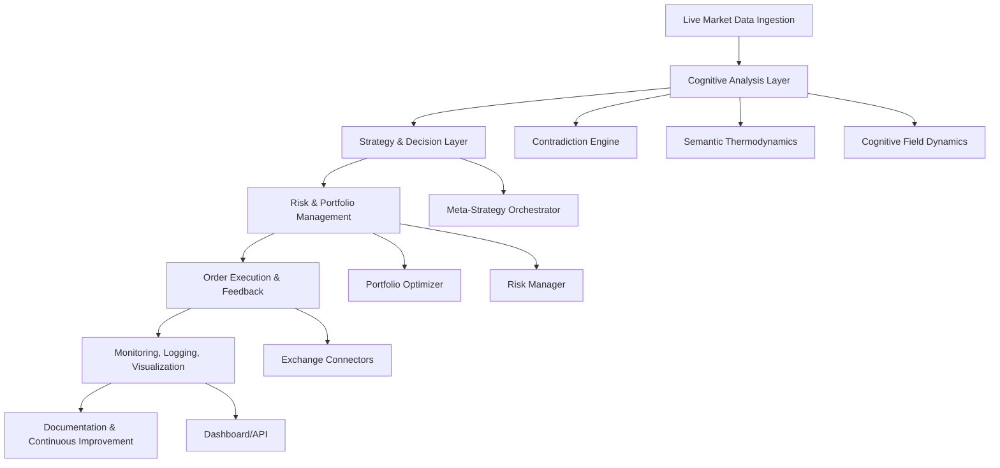

# Kimera SWM Autonomous AI Trading System: Granular Roadmap & Enhancement Plan

---

## 0. Context & Cognitive Alignment

- **Project:** End-to-End Autonomous AI Trading System for Kimera SWM
- **Philosophy:** Cognitive fidelity, neurodivergent context-sensitivity, multi-perspectival/analogy-driven reasoning, visual/graphical thinking ([see `kimera_ai_reference.md`])
- **Objective:** Real, robust, explainable, and adaptive trading system operating on live data, with full feedback and scientific falsifiability.
- **Stakeholders:** Lead developer (Idir Ben Slama), Kimera core team, compliance/security, end-users.
- **Architectural Blueprint:** See [`Autonomous AI Trading System Refinement.md`](../backend/trading/source/Autonomous%20AI%20Trading%20System%20Refinement.md) for rationale on modular monolith, multi-agent AI, and advanced validation.

---

## 1. High-Level Architecture (Mermaid)

---

## 2. Phases, Milestones, Atomic Tasks, and Enhancements

### **Phase 0: Foundations & Context**
- **Deliverables:**
  - [ ] Cognitive fidelity requirements doc
  - [ ] Stakeholder/constraint analysis
  - [ ] Initial architecture diagram
- **Atomic Tasks:**
  - [ ] Review and extract all cognitive/architectural requirements from `kimera_ai_reference.md` and `Autonomous AI Trading System Refinement.md`
  - [ ] Identify all stakeholders and their needs
  - [ ] Set up project management tools (GitHub Project Board, issue templates)
  - [ ] Define roadmap review cadence (bi-weekly)
- **Enhancements:**
  - [ ] Add community feedback mechanisms (e.g., GitHub Discussions, roadmap workshops)
  - [ ] Document rationale for modular monolith (see Section 1.1 in Refinement doc)

### **Phase 1: Architecture & Design**
- **Deliverables:**
  - [ ] System design doc
  - [ ] Updated architecture diagrams (Mermaid, Gantt, dependency graphs)
  - [ ] Coding standards guide
- **Atomic Tasks:**
  - [ ] Draft detailed system architecture (update Mermaid)
  - [ ] Define module boundaries, interfaces, and data contracts
  - [ ] Establish code, logging, and documentation standards
  - [ ] Create initial GitHub repo structure and README for each module
  - [ ] Add visual/graphical requirements for each module
- **Enhancements:**
  - [ ] Add rationale for modular monolith vs. microservices (see Refinement doc)
  - [ ] Add module-level diagrams (e.g., AI Core, Data Ingestion)
  - [ ] Define testability and observability requirements for each module

### **Phase 2: Data & Execution Layer**
- **Deliverables:**
  - [ ] Live data ingestion module
  - [ ] Order manager with feedback loop
  - [ ] Backtesting engine
- **Atomic Tasks:**
  - [ ] Implement robust, production-grade exchange connectors (REST/WebSocket)
  - [ ] Build unified data ingestion/validation pipeline
  - [ ] Develop real order manager (with reconciliation, error handling)
  - [ ] Set up historical data storage and backtesting engine
  - [ ] Integrate time-series database (QuestDB/ArcticDB)
  - [ ] Add connection state monitoring and auto-recovery
- **Enhancements:**
  - [ ] Support for multiple exchanges and asset classes
  - [ ] Add data normalization and cleaning pipeline
  - [ ] Implement event-driven message bus (NATS/Redpanda, see Refinement doc)
  - [ ] Add data quality metrics and logging

### **Phase 3: Cognitive & Strategy Layer**
- **Deliverables:**
  - [ ] Cognitive analysis modules (hardware-aware)
  - [ ] Strategy orchestrator
  - [ ] Risk/portfolio management modules
- **Atomic Tasks:**
  - [ ] Integrate cognitive field, contradiction, and thermodynamic engines
  - [ ] Develop modular, explainable strategy orchestrator (multi-agent AI, see Refinement doc)
  - [ ] Implement risk manager and portfolio optimizer (HRP, Kelly, tail risk hedging)
  - [ ] Add explainability (XAI) and logging to all cognitive decisions
  - [ ] Implement agent-based architecture for AI Core (technical, fundamental, sentiment, risk agents)
- **Enhancements:**
  - [ ] Add support for alternative data (social, satellite, credit card, etc.)
  - [ ] Integrate advanced models (Transformers, GNNs, DRL, see Refinement doc)
  - [ ] Add plug-in system for new strategies/agents
  - [ ] Implement cognitive meta-reasoning and strategy selection

### **Phase 4: Execution & Feedback**
- **Deliverables:**
  - [ ] Live trading loop (testnet, then production)
  - [ ] Feedback and learning pipeline
  - [x] Deployment script skeleton
- **Atomic Tasks:**
  - [ ] Connect all layers for live trading loop
  - [ ] Implement robust fail-safes, circuit breakers, and recovery
  - [ ] Ensure all execution results feed back into cognitive/risk modules
  - [ ] Add immutable audit trails for all trades and decisions
  - [ ] Integrate with broker APIs (with compliance to ToS)
  - [x] Create deployment script with logging and error handling
- **Enhancements:**
  - [ ] Add DRL-based execution agent (see Refinement doc)
  - [ ] Implement smart order routing and adaptive execution
  - [ ] Add real-time reconciliation and error recovery

### **Phase 5: Monitoring, Logging, & Visualization**
- **Deliverables:**
  - [ ] Monitoring/logging system
  - [ ] Dashboard/API
  - [ ] Visualizations (Mermaid, heatmaps, etc.)
- **Atomic Tasks:**
  - [ ] Implement structured, actionable logging throughout
  - [ ] Build real-time dashboard/API for monitoring and visualization
  - [ ] Visualize cognitive field, contradiction maps, and semantic thermodynamics
  - [ ] Integrate Prometheus/Grafana for metrics (see Refinement doc)
  - [ ] Add alerting and health checks for all modules
- **Enhancements:**
  - [ ] Add explainable AI (XAI) visualizations (SHAP, LIME)
  - [ ] Support for user-defined dashboards and custom metrics
  - [ ] Add anomaly detection for system health

### **Phase 6: Testing, Validation, & Scientific Falsification**
- **Deliverables:**
  - [x] Security module implementation (encryption, API key management)
  - [x] Compliance test scaffolding
  - [ ] Test suite (unit, integration, system)
  - [ ] Validation/falsification reports
- **Atomic Tasks:**
  - [x] Implement News API key encapsulation (NewsConfig pattern)
  - [ ] Write exhaustive unit, integration, and adversarial tests
  - [ ] Run live validation and falsification cycles
  - [ ] Document all failures, adaptations, and learning
  - [ ] Implement walk-forward optimization and combinatorial cross-validation (see Refinement doc)
  - [ ] Add alpha decay and risk model backtesting
- **Enhancements:**
  - [ ] Integrate with CI/CD for automated testing
  - [ ] Add test coverage and code quality metrics
  - [ ] Support for simulation of black swan events

### **Phase 7: Documentation, Diagrams, & Continuous Improvement**
- **Deliverables:**
  - [ ] Complete documentation set
  - [ ] Updated diagrams
  - [ ] Runbooks and guides
- **Atomic Tasks:**
  - [ ] Update all code, API, and system documentation
  - [ ] Maintain and update all diagrams and visualizations
  - [ ] Write runbooks, troubleshooting guides, and cognitive model explanations
  - [ ] Add onboarding guides for new contributors
  - [ ] Document all architectural decisions and rationale (link to Refinement doc)
- **Enhancements:**
  - [ ] Add interactive documentation (e.g., Jupyter, MkDocs)
  - [ ] Support for multi-language docs and accessibility
  - [ ] Add contributor guidelines and code of conduct

---

## 3. Roles & Responsibilities (with Contributor Suggestions)

| Role                | Responsibilities                                                      | Potential Contributors/Owners |
|---------------------|-----------------------------------------------------------------------|------------------------------|
| Lead Developer      | Architecture, cognitive fidelity, code reviews, final decisions        | Idir Ben Slama, core team    |
| Cognitive Engineer  | Cognitive/semantic/contradiction engine integration, model validation  | AI/ML specialists            |
| Backend Engineer    | Data ingestion, order management, API, and dashboard                  | Python/Fintech devs          |
| QA/Test Engineer    | Test suite, validation, adversarial testing, scientific falsification  | QA, scientific computing     |
| DevOps/SRE          | Deployment, monitoring, failover, and recovery                        | DevOps, SRE                  |
| Documentation Lead  | Docs, diagrams, runbooks, and knowledge base                          | Tech writers, contributors   |
| Security/Compliance | Security, privacy, regulatory compliance                              | Security, legal, compliance  |

---

## 4. Risk Management & Mitigation (with Open Questions)

| Risk                                 | Mitigation Strategy                                      | Open Questions/Enhancements           |
|--------------------------------------|----------------------------------------------------------|---------------------------------------|
| Exchange API changes/outages         | Modular connectors, fallback logic, monitoring           | Add multi-broker failover, sandboxing |
| Cognitive model drift/overfitting    | Continuous validation, live feedback, scientific review  | Add meta-learning, auto-retraining    |
| Hardware (GPU/CPU) failures          | Device awareness, failover, logging, cloud fallback      | Add cloud burst/failover scripts      |
| Security breaches/data leaks         | Vault, encryption, access controls, regular audits       | Add bug bounty, regular pen-testing   |
| API key exposure                     | Encapsulated NewsConfig pattern, env var management      | Add rotation automation               |
| Regulatory changes                   | Compliance monitoring, modular legal layer               | Add legal API monitoring, alerts      |
| Unexpected market events             | Circuit breakers, real-time risk management              | Add scenario simulation tools         |
| Documentation/knowledge loss         | Continuous docs, runbooks, onboarding guides             | Add knowledge base, video guides      |

---

## 5. KPIs & Success Metrics (with Enhancement Ideas)

- **Cognitive Fidelity Score:** Alignment with Kimera’s philosophy (qualitative + quantitative)
- **System Uptime:** >99.5% (excluding planned maintenance)
- **Order Execution Latency:** <500ms (exchange-dependent)
- **P&L and Risk Metrics:** Sharpe, Sortino, max drawdown, win rate
- **Semantic Accuracy:** % of trades where cognitive/semantic prediction matches outcome
- **Test Coverage:** >90% for critical modules
- **Documentation Coverage:** 100% for public APIs and cognitive models
- **Incident Response Time:** <15min for critical failures
- **Enhancements:**
  - [ ] Add contributor activity and community engagement metrics
  - [ ] Add model explainability and transparency metrics
  - [ ] Add user feedback and satisfaction metrics

---

## 6. Open-Source Project Management & Community Practices

- **Project Boards:** Use GitHub Project Boards for visual roadmap, task tracking, and prioritization ([CNCF Roadmap Guide](https://contribute.cncf.io/maintainers/community/contributor-growth-framework/open-source-roadmaps/)).
- **Issue Templates:** Create templates for bugs, features, enhancements, and research questions.
- **Community Feedback:** Enable GitHub Discussions, regular roadmap workshops, and feedback surveys.
- **Contributor Onboarding:** Maintain clear onboarding guides, code of conduct, and mentorship opportunities.
- **Roadmap Transparency:** Publish and update roadmap in repo; review bi-weekly with community.
- **Iteration:** Embrace living roadmap—update based on feedback, new research, and market changes.
- **Graphical Presentations:** Use diagrams, Gantt charts, and dependency graphs for clarity.

---

## 7. Continuous Review & Living Roadmap Protocols
- [ ] Bi-weekly roadmap review meetings (core team + community)
- [ ] Regular grooming of project boards and issues
- [ ] Annual strategic review and roadmap refresh
- [ ] Encourage open dialogue and consensus-building for prioritization
- [ ] Document all major roadmap changes and rationale

---

## 8. References & Best Practices

- [Kimera AI Reference](../kimera_ai_reference.md)
- [Autonomous AI Trading System Refinement.md](../backend/trading/source/Autonomous%20AI%20Trading%20System%20Refinement.md)
- [Software Roadmap Best Practices](https://emilydaniel3103.medium.com/an-ultimate-roadmap-guide-for-a-software-development-project-d7d5f42ce9ff)
- [Fintech/AI Roadmap Guide](https://dashdevs.com/blog/effective-roadmap-step-by-step/)
- [CNCF Open Source Roadmaps](https://contribute.cncf.io/maintainers/community/contributor-growth-framework/open-source-roadmaps/)
- [Cognitive Fidelity Protocols](`.cursorrules`)

---

> **This roadmap is a living document. All contributors must ensure alignment with Kimera’s cognitive fidelity, scientific rigor, and architectural rationale at every phase.** 