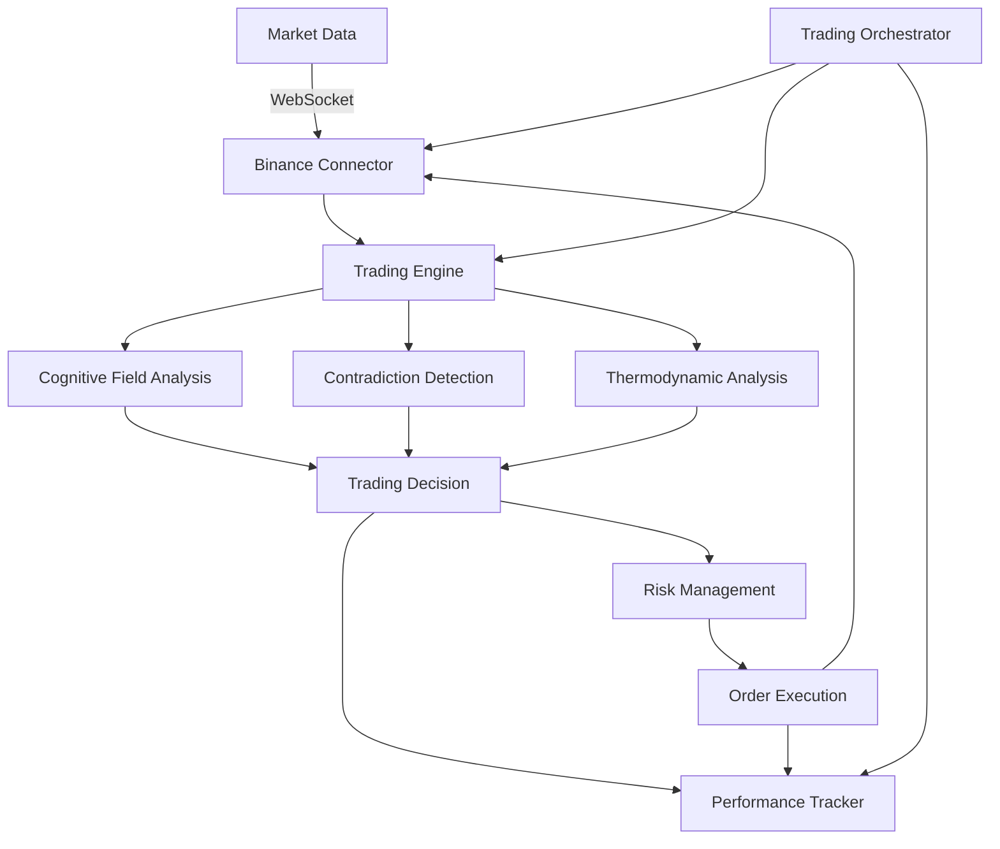

# Kimera Crypto Trading Guide

## Overview

The Kimera Crypto Trading system demonstrates how cognitive field dynamics, contradiction detection, and semantic thermodynamics can be applied to real-time cryptocurrency trading. This plugin leverages Kimera's unique cognitive capabilities to analyze market conditions and make trading decisions under extreme volatility.

## Key Features

### 1. Cognitive Market Analysis
- **Cognitive Field Generation**: Analyzes market data through Kimera's cognitive lens
- **Contradiction Detection**: Identifies market inefficiencies and arbitrage opportunities
- **Semantic Temperature**: Measures market "heat" to detect overheated or undervalued conditions
- **Insight Generation**: Produces actionable trading signals from cognitive analysis

### 2. Real-Time Decision Making
- **High-Pressure Performance**: Designed for crypto's extreme volatility
- **Multi-Factor Analysis**: Combines cognitive pressure, contradictions, and temperature
- **Confidence-Based Sizing**: Position sizes scale with decision confidence
- **Risk Management**: Built-in stop-loss and take-profit mechanisms

### 3. Performance Tracking
- **Cognitive Accuracy**: Measures how well cognitive analysis predicts outcomes
- **Risk-Adjusted Returns**: Sharpe ratio, Sortino ratio, and drawdown analysis
- **Decision Attribution**: Tracks which cognitive factors drive performance

## Architecture



## Quick Start

### 1. Setup

```bash
# Install dependencies
pip install -r requirements.txt

# Create .env file with your API credentials
BINANCE_API_KEY=your_testnet_api_key
BINANCE_API_SECRET=your_testnet_api_secret
```

⚠️ **IMPORTANT**: Always use testnet for testing! Get testnet keys from https://testnet.binance.vision/

### 2. Run the Demo

```bash
python examples/crypto_trading_demo.py
```

### 3. Configuration

Edit `config/trading_config.json` to customize:
- Trading symbols
- Risk parameters
- Cognitive thresholds
- Update intervals

## Trading Logic

### Market State Analysis

The system analyzes each market through multiple cognitive lenses:

1. **Cognitive Pressure** (0-1)
   - High (>0.7): Market uncertainty, reduce positions
   - Low (<0.3): Clear patterns, increase confidence

2. **Contradiction Level** (0-1)
   - High (>0.6): Market inefficiencies, trading opportunities
   - Low (<0.3): Efficient market, fewer opportunities

3. **Semantic Temperature** (0-1)
   - Hot (>0.8): Overheated market, potential reversal
   - Cold (<0.2): Undervalued, accumulation phase

### Decision Making

Trading decisions combine multiple factors:

```python
decision_score = Σ(factor_weight × factor_value)

if decision_score > 0.3 and no_position:
    BUY
elif decision_score < -0.3 and has_position:
    SELL
else:
    HOLD
```

### Position Sizing

Uses modified Kelly Criterion with cognitive adjustments:

```python
position_size = base_risk × confidence × (1 / (1 + volatility))
```

## Risk Management

### Built-in Safeguards

1. **Position Limits**
   - Max 10% per position
   - Max 3 concurrent positions
   - Daily loss limit: 5%

2. **Stop Loss & Take Profit**
   - Stop loss: 2× volatility
   - Take profit: 3× volatility × confidence

3. **Circuit Breakers**
   - Pause trading if daily loss exceeded
   - Stop if cognitive pressure too high

## Performance Metrics

### Real-Time Tracking

```json
{
    "total_pnl": 523.45,
    "win_rate": 62.5,
    "sharpe_ratio": 1.85,
    "cognitive_accuracy": 0.73,
    "best_conditions": {
        "contradiction_level": ">0.6",
        "temperature": "<0.3"
    }
}
```

### Cognitive Performance Analysis

The system tracks which cognitive factors lead to profitable trades:

- **High Confidence Success Rate**: Measures if high-confidence trades perform well
- **Condition Analysis**: Identifies market conditions that work best
- **Decision Attribution**: Shows which factors contributed to each decision

## API Integration

### Supported Exchanges

Currently supports Binance (spot trading). The architecture allows easy addition of other exchanges.

### WebSocket Streams

Real-time data streams:
- Ticker updates
- Order book depth
- Trade executions
- Account updates

### Rate Limiting

Respects exchange limits:
- 1200 requests/minute
- 10 WebSocket connections
- Automatic retry with backoff

## Advanced Usage

### Custom Strategies

Extend the base trading engine:

```python
class MyCustomStrategy(KimeraTradingEngine):
    async def make_trading_decision(self, symbol, market_state, portfolio):
        # Your custom logic here
        decision = await super().make_trading_decision(
            symbol, market_state, portfolio
        )
        
        # Modify decision based on your rules
        if self.my_custom_indicator(market_state) > threshold:
            decision.confidence *= 1.5
            
        return decision
```

### Backtesting

(Coming soon) Test strategies on historical data:

```python
backtester = KimeraBacktester(strategy, historical_data)
results = await backtester.run(
    start_date="2024-01-01",
    end_date="2024-12-31"
)
```

## Safety & Best Practices

### Development

1. **Always use testnet first**
2. **Start with small position sizes**
3. **Monitor performance closely**
4. **Set conservative risk limits**

### Production

1. **Never commit API keys**
2. **Use read-only keys when possible**
3. **Implement additional safeguards**
4. **Regular performance audits**
5. **Have manual override capability**

## Troubleshooting

### Common Issues

1. **"Missing API credentials"**
   - Ensure .env file exists with valid keys
   - Check file permissions

2. **"Connection refused"**
   - Verify internet connection
   - Check if using correct endpoint (testnet vs mainnet)

3. **"Insufficient balance"**
   - Testnet requires manual faucet funding
   - Check account has USDT balance

### Debug Mode

Enable detailed logging:

```python
logging.basicConfig(level=logging.DEBUG)
```

## Future Enhancements

### Planned Features

1. **Multi-Exchange Support**
   - Kraken, Coinbase, FTX integration
   - Cross-exchange arbitrage

2. **Advanced Strategies**
   - Market making
   - Statistical arbitrage
   - Options trading

3. **ML Integration**
   - Train on historical decisions
   - Adaptive parameter tuning
   - Pattern recognition

4. **Risk Analytics**
   - VaR calculations
   - Stress testing
   - Portfolio optimization

## Disclaimer

⚠️ **IMPORTANT WARNING** ⚠️

This software is for educational and research purposes only. Cryptocurrency trading involves substantial risk of loss. Past performance does not guarantee future results. Never trade with money you cannot afford to lose.

The developers assume no liability for financial losses incurred through use of this software. Always conduct your own research and consider consulting with financial advisors.

## Support

For questions or issues:
1. Check the [FAQ](../03_Analysis_and_Reports/trading_faq.md)
2. Review [example code](../../examples/crypto_trading_demo.py)
3. Open an issue on GitHub

---

*Remember: The market is a complex adaptive system. Kimera helps navigate it, but cannot eliminate risk.* 