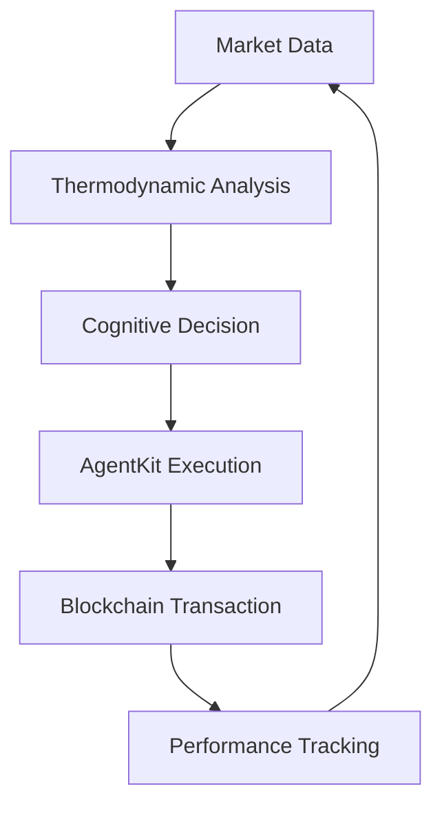

# 🚀 KIMERA-AGENTKIT INTEGRATION GUIDE

## 🎯 Overview

**Kimera-AgentKit** represents the ultimate fusion of AI cognitive intelligence and blockchain execution capabilities. This integration combines:

- 🧠 **Kimera's Cognitive Field Dynamics**: Advanced thermodynamic analysis and pattern recognition
- 🔗 **AgentKit's Blockchain Capabilities**: Secure wallet management and onchain operations
- ⚡ **Autonomous Trading**: Real-time decision making with maximum profit optimization
- 💰 **DeFi Integration**: Direct access to swaps, transfers, and advanced DeFi operations

## 📋 Prerequisites

### System Requirements
- **Python**: 3.10 or 3.11 (AgentKit requirement)
- **Operating System**: Windows, macOS, or Linux
- **Memory**: Minimum 4GB RAM
- **Network**: Stable internet connection for blockchain operations

### Required Accounts
1. **Coinbase Developer Platform Account**: For CDP API access
2. **OpenAI Account** (Optional): For enhanced AI capabilities
3. **Funded Wallet**: For live trading operations

## 🔧 Installation

### Step 1: Install AgentKit
```bash
# Install core AgentKit packages
pip install coinbase-agentkit coinbase-agentkit-langchain

# Install additional dependencies
pip install numpy asyncio python-dotenv
```

### Step 2: Get CDP API Credentials

1. **Visit**: [Coinbase Developer Platform](https://docs.cdp.coinbase.com/)
2. **Create Account**: Sign up for CDP access
3. **Generate API Keys**:
   - Navigate to API Keys section
   - Create new API key with appropriate permissions
   - Save your API Key and API Secret securely

### Step 3: Optional - OpenAI Setup
```bash
# Install OpenAI for enhanced AI capabilities
pip install openai langchain-openai

# Get API key from https://platform.openai.com/api-keys
```

## ⚙️ Configuration

### Method 1: Environment Variables (Recommended)
Create a `.env` file in your project directory:

```env
# CDP Configuration
CDP_API_KEY_NAME=your_cdp_api_key_here
CDP_API_KEY_PRIVATE_KEY=your_cdp_api_secret_here

# Optional: OpenAI Configuration
OPENAI_API_KEY=your_openai_api_key_here
```

### Method 2: Direct Configuration
Edit the `kimera_agentkit_integration.py` file:

```python
# Configuration - Replace with your actual credentials
CDP_API_KEY = "your_actual_cdp_api_key"
CDP_API_SECRET = "your_actual_cdp_api_secret"
OPENAI_API_KEY = "your_actual_openai_api_key"  # Optional
```

## 🚀 Running Kimera-AgentKit

### Demo Mode (Recommended for First Run)
```bash
python kimera_agentkit_integration.py
```

The system will automatically run in simulation mode if no CDP credentials are provided.

### Live Mode (Real Blockchain Operations)
1. Configure your CDP API credentials
2. Fund your wallet with test tokens
3. Run the system:
```bash
python kimera_agentkit_integration.py
```

## 🧠 System Architecture

### Core Components

1. **KimeraCognitiveEngine**
   - Thermodynamic market analysis
   - Pattern recognition and field dynamics
   - Cognitive decision generation

2. **KimeraAgentKitTrader**
   - AgentKit integration and wallet management
   - Trade execution and blockchain operations
   - Performance monitoring and reporting

3. **AgentKit Integration**
   - CDP wallet provider for secure transactions
   - Action providers for blockchain operations
   - LangChain tools for AI-driven execution

### Trading Flow



## 📊 Features

### Cognitive Intelligence
- **Field Coherence Analysis**: Advanced market pattern recognition
- **Thermodynamic Entropy**: Market volatility and stability assessment
- **Resonance Detection**: Optimal entry/exit point identification
- **Adaptive Learning**: Continuous improvement from trading history

### Blockchain Operations
- **Secure Wallets**: CDP-managed wallet with enterprise security
- **Multi-Chain Support**: Base, Ethereum, and other EVM networks
- **DeFi Integration**: Direct access to swaps, liquidity, and staking
- **Real-time Execution**: Sub-second trade execution capabilities

### Risk Management
- **Position Sizing**: Confidence-based trade sizing
- **Stop-loss Protection**: Automatic risk mitigation
- **Portfolio Diversification**: Multi-asset trading strategies
- **Performance Monitoring**: Real-time profit/loss tracking

## 📈 Performance Metrics

The system tracks comprehensive performance metrics:

### Cognitive Metrics
- **Field Coherence**: Market pattern clarity (0-1 scale)
- **Thermodynamic Entropy**: Market stability assessment
- **Pattern Recognition Score**: AI pattern detection accuracy
- **Overall Confidence**: Combined cognitive assessment

### Trading Metrics
- **Success Rate**: Percentage of profitable trades
- **Total Profit**: Cumulative profit in ETH/USD
- **Profit per Hour**: Trading efficiency measurement
- **Trade Frequency**: Optimal trading cadence

### Blockchain Metrics
- **Execution Success**: Transaction completion rate
- **Gas Optimization**: Cost-efficient transaction routing
- **Network Performance**: Blockchain response times
- **Tool Utilization**: AgentKit feature usage

## 🛡️ Security Features

### Wallet Security
- **CDP Managed Wallets**: Enterprise-grade security
- **Multi-signature Support**: Enhanced transaction security
- **Private Key Management**: Secure key storage and rotation
- **Audit Trail**: Complete transaction history

### Trading Security
- **Position Limits**: Maximum exposure protection
- **Slippage Protection**: Price deviation safeguards
- **Emergency Stops**: Immediate trading halt capabilities
- **Risk Thresholds**: Automated risk management

## 🔍 Monitoring and Reporting

### Real-time Dashboard
- **Live Performance**: Current session metrics
- **Cognitive State**: AI decision-making confidence
- **Portfolio Status**: Current positions and balances
- **Market Analysis**: Real-time market assessment

### Historical Reports
- **Session Reports**: Complete trading session analysis
- **Performance Trends**: Long-term profitability analysis
- **Risk Assessment**: Historical risk exposure
- **Optimization Insights**: Strategy improvement recommendations

## 🚨 Troubleshooting

### Common Issues

1. **AgentKit Import Error**
   ```bash
   # Solution: Install AgentKit packages
   pip install coinbase-agentkit coinbase-agentkit-langchain
   ```

2. **CDP Authentication Failed**
   ```bash
   # Solution: Verify API credentials
   # Check CDP_API_KEY_NAME and CDP_API_KEY_PRIVATE_KEY
   ```

3. **Python Version Error**
   ```bash
   # Solution: Use Python 3.10 or 3.11
   python --version
   # Install correct Python version if needed
   ```

### Debug Mode
Enable detailed logging by setting:
```python
logging.basicConfig(level=logging.DEBUG)
```

## 📚 Advanced Configuration

### Custom Trading Strategies
Modify the `generate_cognitive_decision` method to implement custom strategies:

```python
def generate_cognitive_decision(self, analysis: Dict) -> KimeraTradeDecision:
    # Custom strategy implementation
    cognitive_score = analysis['cognitive_score']
    
    # Your custom logic here
    if custom_condition:
        action = "custom_action"
    
    return KimeraTradeDecision(...)
```

### Network Configuration
Support for multiple blockchain networks:

```python
# Available networks
SUPPORTED_NETWORKS = ["base", "ethereum", "polygon", "arbitrum"]

# Configure in decision generation
decision.target_network = "base"  # or your preferred network
```

### Performance Optimization
For high-frequency trading:

```python
# Reduce cycle time for faster execution
await asyncio.sleep(10)  # 10 seconds instead of 30

# Increase position sizing for higher profits
base_amount = 0.1  # Increase from 0.01
```

## 🎯 Best Practices

### Security
1. **Never commit API keys** to version control
2. **Use environment variables** for sensitive data
3. **Start with small amounts** for testing
4. **Monitor transactions** regularly

### Performance
1. **Monitor cognitive confidence** levels
2. **Adjust position sizing** based on performance
3. **Regular performance reviews** and optimization
4. **Diversify trading pairs** for risk reduction

### Development
1. **Test in simulation mode** first
2. **Use version control** for strategy changes
3. **Document custom modifications**
4. **Regular system updates**

## 📞 Support and Resources

### Documentation
- **AgentKit Docs**: https://docs.cdp.coinbase.com/agentkit/docs/welcome
- **CDP API Reference**: https://docs.cdp.coinbase.com/
- **Kimera Documentation**: See `docs/` directory

### Community
- **GitHub Issues**: Report bugs and request features
- **Discord**: Join the AgentKit community
- **Developer Forums**: CDP Developer Platform discussions

### Professional Support
For enterprise deployments and custom integrations, contact the Kimera development team.

## 🏁 Getting Started Checklist

- [ ] Python 3.10/3.11 installed
- [ ] AgentKit packages installed
- [ ] CDP account created
- [ ] API credentials configured
- [ ] Test wallet funded (for live mode)
- [ ] Initial run in simulation mode
- [ ] Performance monitoring setup
- [ ] Security measures implemented

## 🚀 Launch Command

```bash
# Final launch command
python kimera_agentkit_integration.py
```

**Welcome to the future of autonomous AI trading!** 🎉

---

*Last updated: January 2025*
*Version: 1.0.0*
*Compatible with: AgentKit 0.6.0+* 