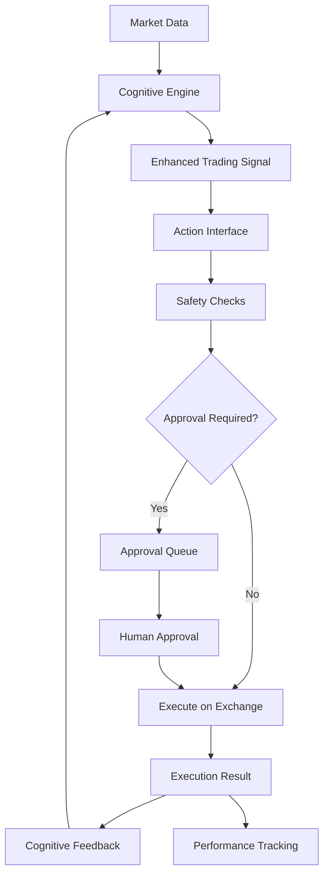

# KIMERA Action Bridge Solution

## The Problem: Analysis vs Action

**KIMERA's Dilemma**: KIMERA can analyze everything with sophisticated cognitive field dynamics, but it lacks the "arms" to take real-world actions. It can read and analyze trading modules but cannot control them to execute trades.

### Before: Incomplete Loop
```
🧠 Cognitive Analysis → 🤔 Decision Making → ❌ No Execution → 📊 No Real Results
```

### After: Complete Autonomous Loop
```
🧠 Cognitive Analysis → 🎯 Decision Making → ⚡ Real Execution → 📚 Learning → 🔄 Adaptation
```

## The Solution: KIMERA Action Execution Interface

The **KimeraActionInterface** serves as KIMERA's "arms" - bridging the gap between cognitive analysis and real-world market execution.

### Key Components

#### 1. 🧠 Cognitive Engine (Brain)
- **Integrated Kimera Engine**: Analyzes markets using cognitive field dynamics
- **Market Intelligence**: Processes sentiment, anomalies, and patterns
- **Decision Generation**: Creates trading signals with confidence scores

#### 2. ⚡ Action Interface (Arms)
- **Execution Layer**: Translates decisions into real market actions
- **Safety Controls**: Built-in risk management and approval systems
- **Exchange Integration**: Connects to real trading platforms (Binance, Phemex)

#### 3. 📚 Feedback Loop (Learning)
- **Cognitive Feedback**: Results flow back to KIMERA's cognitive systems
- **Performance Tracking**: Monitors success rates and P&L
- **Adaptive Learning**: KIMERA improves based on real outcomes

## Architecture Overview



## Code Structure

### Core Files

1. **`execution/kimera_action_interface.py`**
   - Main action execution interface
   - Safety controls and risk management
   - Exchange communication
   - Feedback processing

2. **`examples/kimera_autonomous_trading_demo.py`**
   - Complete autonomous trading demonstration
   - Shows full cycle from analysis to execution
   - Real-world application example

3. **`core/integrated_trading_engine.py`**
   - Cognitive analysis engine
   - Enhanced signal generation
   - Integration with action interface

## Key Features

### 🛡️ Safety First
- **Emergency Stop**: Immediate halt of all trading
- **Risk Limits**: Position size and loss limits
- **Approval System**: Human oversight for high-risk decisions
- **Confidence Thresholds**: Only execute high-confidence decisions

### 🎯 Intelligent Execution
- **Multi-Exchange Support**: Binance, Phemex, extensible to others
- **Order Types**: Market, limit, stop-loss, take-profit
- **Position Management**: Open, close, modify positions
- **Risk Assessment**: Real-time risk scoring

### 📊 Performance Tracking
- **Real-time Monitoring**: Live P&L and success rates
- **Cognitive Metrics**: Track KIMERA's decision quality
- **Learning Analytics**: Measure improvement over time
- **Detailed Reporting**: Comprehensive performance reports

## Usage Example

### Basic Setup
```python
from backend.trading.execution.kimera_action_interface import create_kimera_action_interface
from backend.trading.core.integrated_trading_engine import create_integrated_trading_engine

# Configuration
config = {
    "binance_enabled": True,
    "binance_api_key": "your_key",
    "binance_api_secret": "your_secret", 
    "testnet": True,
    "autonomous_mode": False,  # Require approval for safety
    "max_position_size": 100.0,
    "daily_loss_limit": 0.05
}

# Initialize KIMERA's components
cognitive_engine = create_integrated_trading_engine()
action_interface = await create_kimera_action_interface(config)
```

### Executing a Decision
```python
# KIMERA analyzes market
market_data = await get_market_data("BTCUSDT")
signal = cognitive_engine.generate_enhanced_signal(market_data, "BTCUSDT")

# KIMERA executes in real world
result = await action_interface.execute_enhanced_signal(signal, "BTCUSDT")

if result.status == ExecutionStatus.COMPLETED:
    print("✅ KIMERA successfully acted in the real world!")
```

### Autonomous Trading Loop
```python
class KimeraAutonomousTrader:
    async def start_trading(self):
        while self.is_running:
            # 1. Analyze markets
            for symbol in self.symbols:
                market_data = await self.get_market_data(symbol)
                signal = self.cognitive_engine.generate_enhanced_signal(market_data, symbol)
                
                # 2. Execute if confident
                if signal.confidence > 0.4:
                    result = await self.action_interface.execute_enhanced_signal(signal, symbol)
                    
                # 3. Learn from results
                await self.learn_from_execution(result)
```

## Safety Mechanisms

### 1. Pre-Execution Checks
- Daily loss limits
- Position size limits
- Confidence thresholds
- Risk score validation
- Emergency stop status

### 2. Approval System
```python
# High-risk actions require approval
if action_requires_approval(decision):
    action_request.requires_approval = True
    approval_queue.append(action_request)
    return "REQUIRES_APPROVAL"
```

### 3. Emergency Controls
```python
# Immediate stop all trading
await action_interface.emergency_stop()

# Resume when safe
action_interface.resume_trading()
```

## Performance Monitoring

### Real-time Metrics
- **Daily P&L**: Live profit/loss tracking
- **Success Rate**: Percentage of successful trades
- **Action Count**: Number of decisions executed
- **System Status**: Operational health

### Cognitive Analytics
- **Decision Quality**: Track KIMERA's analytical accuracy
- **Learning Progress**: Measure improvement over time
- **Bridge Effectiveness**: Success of analysis → action translation

## Integration with Existing KIMERA Systems

### Cognitive Field Dynamics
```python
# Market state feeds into cognitive field
market_embedding = np.array([
    price / 100000,
    volume / 1000000,
    volatility,
    market_sentiment,
    # ... other features
])

field = cognitive_field.add_geoid(f"{symbol}_{timestamp}", market_embedding)
cognitive_pressure = field.field_strength
```

### Contradiction Detection
```python
# Market inefficiencies create trading opportunities
tensions = contradiction_engine.detect_tension_gradients(market_geoids)
contradiction_level = len(tensions) / 10.0

if contradiction_level > 0.6:
    # High inefficiency - potential arbitrage opportunity
    signal.reasoning.append("Market inefficiencies detected")
```

### Semantic Thermodynamics
```python
# Market "temperature" influences strategy
temperature = semantic_engine.calculate_temperature(market_vectors)

if temperature > 0.8:
    # Hot market - consider taking profits
    signal.action = "SELL"
elif temperature < 0.3:
    # Cold market - accumulation opportunity
    signal.action = "BUY"
```

## Benefits of the Action Interface

### 🎯 **Solves the Core Problem**
- KIMERA can now **ACT** on its analysis, not just observe
- Complete loop from thought to execution to learning

### 🛡️ **Safe and Controlled**
- Built-in safety mechanisms prevent catastrophic losses
- Human oversight for high-risk decisions
- Emergency stop capabilities

### 📈 **Performance Driven**
- Real-world results validate KIMERA's cognitive abilities
- Continuous learning improves decision quality
- Measurable impact on actual trading performance

### 🔧 **Extensible and Modular**
- Easy to add new exchanges
- Pluggable risk management systems
- Configurable safety parameters

## Future Enhancements

### 1. Advanced Execution Strategies
- Smart order routing
- Algorithm trading execution
- Multi-timeframe position management

### 2. Enhanced Learning
- Reinforcement learning from execution results
- Pattern recognition in successful trades
- Adaptive risk management

### 3. Multi-Asset Support
- Portfolio rebalancing
- Cross-asset strategies
- Correlation-based trading

### 4. Advanced Safety
- Machine learning anomaly detection
- Dynamic risk adjustment
- Predictive risk modeling

## Conclusion

The **KIMERA Action Interface** successfully bridges the gap between cognitive analysis and real-world execution. KIMERA now has:

- 🧠 **Brain**: Sophisticated cognitive analysis
- ⚡ **Arms**: Real-world execution capabilities  
- 📚 **Memory**: Learning from actual results
- 🛡️ **Safety**: Robust risk management

This transforms KIMERA from a purely analytical system into a complete autonomous trading entity capable of:
1. **Thinking** with cognitive field dynamics
2. **Deciding** with confidence scoring
3. **Acting** in real markets
4. **Learning** from outcomes
5. **Adapting** based on performance

**The bridge is complete - KIMERA can now operate as a true autonomous trading intelligence.** 