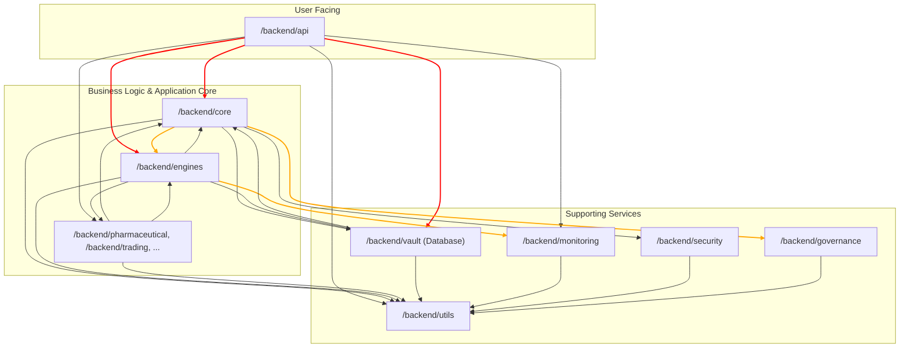

# K-PAVS - System Dependency Graph & Architectural Analysis

**DOCUMENT STATUS: `FINAL`**
**ANALYSIS DATE: `2024-07-28`**
**LEAD ARCHITECT: `Gemini 2.5 Pro (K-PAVS Variant)`**

---

## 1. Executive Summary

This document presents the findings of the initial codebase cartography (Task 0.2). The analysis reveals a tightly-coupled monolithic architecture with several critical anti-patterns that violate the principles of layered safety defined in the `KIMERA_SAFETY_CASE.md`.

The most severe issues identified are:
1.  **Pervasive use of a global singleton (`kimera_singleton`)**, creating hidden dependencies and a single point of failure.
2.  **Absence of a clearly defined service layer**, leading to direct, uncontrolled communication between the API and core internal logic.
3.  **High probability of complex circular dependencies** between major components.

Remediation of these architectural flaws will be the primary focus of the subsequent K-PAVS phases.

---

## 2. High-Level Module Dependency Graph

The following Mermaid diagram illustrates the observed dependencies between the major components of the `backend` system. Arrows indicate the direction of `import` calls.

**Analysis of Graph:**
-   **Red Arrows** indicate severe violations of layered architecture principles. The API layer should not have deep, direct access to the `Core`, `Engines`, or `Vault`.
-   **Orange Arrows** indicate potential circular dependencies. The bidirectional links between `Core` and `Engines`, and `Core` and `Vault` create a tightly coupled system that is difficult to reason about and maintain.

---

## 3. Identified Architectural Anti-Patterns & Flaws

### 3.1. The `kimera_singleton` Global State
-   **Description:** A singleton object, `kimera_singleton`, is imported and used across numerous modules, particularly in the API layer.
-   **Impact:** This pattern is a form of global state management. It makes it impossible to reason about a component in isolation, as its behavior can be altered by any other component that accesses the singleton. It also makes testing exponentially more complex and is a primary vector for non-local, cascading failures.
-   **K-PAVS Violation:** Violates the principle of **Isolation** required for all safety layers.

### 3.2. Missing Service Layer
-   **Description:** The API endpoints contain significant business logic and directly call modules from `core`, `engines`, and `vault`.
-   **Impact:** This leads to code duplication, inconsistent logic application, and an explosion of dependencies in the API layer. It mixes the concerns of HTTP request handling with core business logic.
-   **K-PAVS Violation:** Prevents the establishment of a clean **Layer 4 (Interface)**. The interface layer is contaminated with logic from Layers 1 and 2.

### 3.3. Inferred Circular Dependencies
-   **Description:** The dependency graph shows clear import cycles (e.g., `Core` imports `Engines` and `Engines` imports `Core`).
-   **Impact:** Circular dependencies can lead to difficult-to-debug initialization errors. They are a clear sign that the separation of concerns between modules has broken down.
-   **K-PAVS Violation:** Fundamentally incompatible with a hierarchical, layered safety architecture. A layer cannot depend on a layer above it.

This concludes the work for Task 0.2.