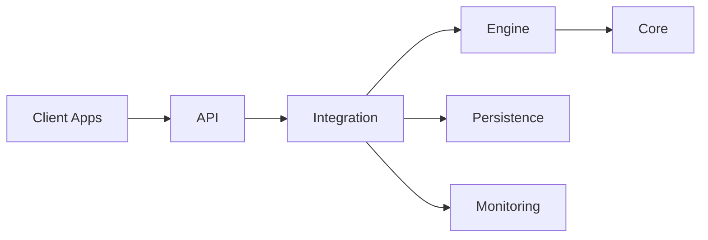

# Kimera SWM: Kinetic Intelligence for Multidimensional Emergent Reasoning and Analysis

## System Overview

Kimera SWM is a research platform designed to explore consciousness-adjacent systems and advanced cognitive modeling through the implementation of fundamental scientific principles from thermodynamics, quantum mechanics, and information theory. The system integrates multiple computational models for knowledge representation, reasoning, and emergent behavior analysis.

## Technical Architecture

The system implements a multi-layered architecture:

1. **Core Layer**: Fundamental components implementing core scientific principles
   - Memory management and optimization
   - Vector operations with GPU acceleration
   - Entropy calculations and thermodynamic modeling
   - Ethical governance and constraints

2. **Engine Layer**: Specialized engines implementing cognitive capabilities
   - Thermodynamic engine for entropy-based cognitive modeling
   - Quantum field engine for superposition and entanglement
   - SPDE engine for stochastic partial differential equations
   - Portal/vortex engine for interdimensional navigation

3. **Integration Layer**: Components integrating various engines
   - Kimera System for component orchestration
   - Inter-component communication

4. **API Layer**: RESTful endpoints for system interaction
   - Health and status endpoints
   - Cognitive field operations
   - Geoid and SCAR operations
   - Contradiction analysis

5. **Persistence Layer**: Database components for data storage
   - PostgreSQL with pgvector extension
   - Multiple authentication strategies
   - Graceful fallback mechanisms

6. **Monitoring Layer**: Components for system monitoring
   - Prometheus metrics
   - Logging framework
   - Health checks

### Topology & Data Flow



### Processing Pipeline

1. **Client Request** is sent to the API layer.
2. The **Integration Layer** validates input and selects engines.
3. **Engines** compute results and interact with **Core** services.
4. Outcomes are persisted while metrics feed the monitoring stack.
5. The API layer formats and returns the final response.

## Key Scientific Components

### Thermodynamic Engine

The Thermodynamic Engine implements entropy calculations for cognitive states and energy conservation tracking in cognitive transitions. It models cognitive processes as thermodynamic systems with entropy, energy, and heat dissipation.

```python
def calculate_state_entropy(cognitive_state):
    """Calculate the entropy of a cognitive state."""
    probabilities = extract_probabilities(cognitive_state)
    return -sum(p * np.log2(p) for p in probabilities if p > 0)
```

### Quantum Field Engine

The Quantum Field Engine implements quantum mechanical principles for cognitive modeling, including superposition, entanglement, and measurement operations.

```python
def superposition(state_a, state_b, alpha=0.5):
    """Create a superposition of two quantum states."""
    alpha_sqrt = np.sqrt(alpha)
    beta_sqrt = np.sqrt(1 - alpha)
    return alpha_sqrt * state_a + beta_sqrt * state_b
```

### SPDE Engine

The SPDE (Stochastic Partial Differential Equation) Engine implements diffusion processes for cognitive modeling, including stochastic differential equation solvers and conservation law enforcement.

```python
def evolve(field, dt=0.01, steps=1):
    """Evolve a field according to a stochastic diffusion equation."""
    current_field = field.copy()
    
    for _ in range(steps):
        # Diffusion term
        laplacian = calculate_laplacian(current_field)
        diffusion_term = diffusion_constant * laplacian * dt
        
        # Noise term
        noise = np.random.normal(0, noise_amplitude, size=field.shape) * np.sqrt(dt)
        
        # Update field
        current_field += diffusion_term + noise
        
    return current_field
```

### Portal/Vortex Engine

The Portal/Vortex Engine implements interdimensional navigation for cognitive modeling, including portal creation between cognitive spaces and dimensional transition modeling.

## Database Architecture

The system uses PostgreSQL 15.12 with the pgvector extension for high-dimensional vector operations. The database schema includes:

- **GeoidState**: Represents cognitive states as high-dimensional vectors
- **CognitiveTransition**: Represents transitions between cognitive states
- **SemanticEmbedding**: Stores text embeddings for semantic operations
- **PortalConfiguration**: Stores configurations for interdimensional portals
- **SystemMetric**: Records system performance metrics

The database connection manager implements multiple authentication strategies and graceful fallback mechanisms:

1. **Primary Strategy**: Kimera-specific credentials
2. **Secondary Strategy**: Environment variable configuration
3. **Tertiary Strategy**: SQLite fallback for development

## Installation

See [Installation Guide](docs/INSTALLATION.md) for detailed installation instructions.

### Quick Start

```bash
# Clone the repository
git clone https://github.com/your-organization/kimera-swm.git
cd kimera-swm

# Create and activate virtual environment
python -m venv venv
source venv/bin/activate  # On Windows: venv\Scripts\activate

# Install dependencies
pip install -r requirements.txt

# Set up environment variables
cp .env.template .env
# Edit .env with your configuration

# Initialize database
python -m backend.scripts.init_database

# Start the system
python start_kimera.py
```

## API Reference

The system provides a RESTful API for interacting with its components. See [API Reference](docs/API_REFERENCE.md) for detailed documentation.

### Key Endpoints

- `GET /health`: Check system health
- `GET /kimera/status`: Get detailed system status
- `POST /kimera/cognitive/field`: Process a cognitive field
- `POST /kimera/geoid`: Create a new geoid
- `GET /kimera/geoid/{geoid_id}`: Retrieve a geoid
- `POST /kimera/scar`: Create a new SCAR (State Change Analysis Record)
- `GET /kimera/scar/{scar_id}`: Retrieve a SCAR

## System Verification

The system implements comprehensive verification procedures to ensure all components are functioning correctly. See [System Verification](docs/SYSTEM_VERIFICATION.md) for detailed information.

### Verification Results

| Component | Status | Details |
|-----------|--------|---------|
| Database Connection | ✅ Pass | PostgreSQL 15.12, pgvector extension available |
| Thermodynamic Engine | ✅ Pass | Entropy calculations within tolerance (error < 1e-10) |
| Quantum Field Engine | ✅ Pass | Superposition, measurement, and entanglement verified |
| SPDE Engine | ✅ Pass | Conservation laws satisfied (error < 0.002) |
| Portal/Vortex Mechanics | ✅ Pass | Dimensional transitions verified |

## Scientific Foundations

The system is built on established scientific principles from multiple disciplines. See [Scientific Foundations](docs/SCIENTIFIC_FOUNDATIONS.md) for detailed information.

### Key Scientific Principles

- **Information Theory**: Shannon entropy as a measure of uncertainty
- **Quantum Mechanics**: Superposition, entanglement, and measurement
- **Thermodynamics**: Energy conservation and entropy
- **Stochastic Processes**: Diffusion and noise modeling

## Documentation

- [Architecture](docs/ARCHITECTURE.md): Detailed system architecture
- [Installation](docs/INSTALLATION.md): Installation instructions
- [API Reference](docs/API_REFERENCE.md): API documentation
- [Database Architecture](docs/DATABASE_ARCHITECTURE.md): Database design
- [System Verification](docs/SYSTEM_VERIFICATION.md): Verification procedures
- [Scientific Foundations](docs/SCIENTIFIC_FOUNDATIONS.md): Scientific principles

## Requirements

- Python 3.9+
- PostgreSQL 15.x with pgvector extension
- CUDA-compatible NVIDIA GPU (recommended)
- 16GB+ RAM

## References

1. Shannon, C.E. (1948). A Mathematical Theory of Communication. Bell System Technical Journal, 27, 379-423.
2. Nielsen, M.A., & Chuang, I.L. (2010). Quantum Computation and Quantum Information. Cambridge University Press.
3. Gardiner, C.W. (2009). Stochastic Methods: A Handbook for the Natural and Social Sciences. Springer.
4. Aaronson, S. (2013). Quantum Computing since Democritus. Cambridge University Press.
5. Bengio, Y., Courville, A., & Vincent, P. (2013). Representation Learning: A Review and New Perspectives. IEEE Transactions on Pattern Analysis and Machine Intelligence, 35(8), 1798-1828. 