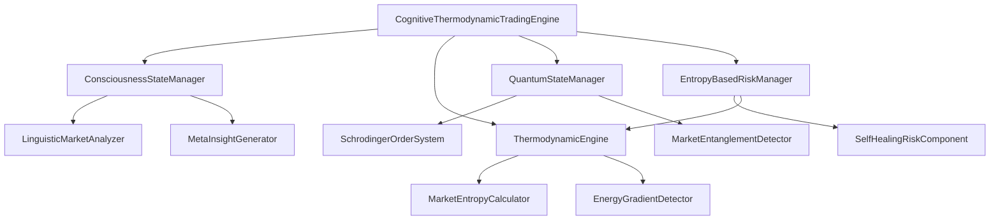

# KIMERA SWM System Components

## Component Architecture

The KIMERA SWM system is composed of interconnected components organized into logical layers.

## Core Components

### Cognitive Components

#### ConsciousnessStateManager
- **Purpose**: Manages the conscious state of the trading system
- **Location**: `src/core/consciousness.py`
- **Key Features**:
  - State tracking and transitions
  - Awareness level management
  - Decision context maintenance

#### LinguisticMarketAnalyzer
- **Purpose**: Analyzes market conditions using natural language processing
- **Location**: `src/cognitive/linguistic_market.py`
- **Key Features**:
  - Sentiment analysis
  - News impact assessment
  - Language pattern recognition

#### MetaInsightGenerator
- **Purpose**: Generates higher-order insights from market data
- **Location**: `src/cognitive/meta_insight.py`
- **Key Features**:
  - Pattern recognition
  - Insight synthesis
  - Meta-learning capabilities

### Quantum Components

#### QuantumStateManager
- **Purpose**: Manages quantum states for the trading system
- **Location**: `src/quantum/superposition.py`
- **Key Features**:
  - State superposition management
  - Quantum measurement simulation
  - Operator application

#### SchrodingerOrderSystem
- **Purpose**: Implements quantum-inspired order management
- **Location**: `src/execution/schrodinger_orders.py`
- **Key Features**:
  - Superposition orders
  - Probabilistic execution
  - State collapse handling

#### MarketEntanglementDetector
- **Purpose**: Detects quantum entanglement-like relationships in markets
- **Location**: `src/quantum/entanglement.py`
- **Key Features**:
  - Correlation analysis
  - Entanglement strength measurement
  - Relationship mapping

### Thermodynamic Components

#### ThermodynamicEngine
- **Purpose**: Core thermodynamic processing engine
- **Location**: `src/thermodynamic/entropy_engine.py`
- **Key Features**:
  - Entropy calculation
  - Energy state management
  - Thermodynamic modeling

#### MarketEntropyCalculator
- **Purpose**: Calculates market entropy for risk assessment
- **Location**: `src/thermodynamic/entropy_engine.py`
- **Key Features**:
  - Market entropy computation
  - Volatility analysis
  - Uncertainty quantification

#### EnergyGradientDetector
- **Purpose**: Detects energy gradients in market data
- **Location**: `src/thermodynamic/energy_flow.py`
- **Key Features**:
  - Energy flow analysis
  - Gradient detection
  - Flow direction determination

### Risk Management Components

#### EntropyBasedRiskManager
- **Purpose**: Manages risk through entropy-based calculations
- **Location**: `src/risk/entropy_limits.py`
- **Key Features**:
  - Position sizing by entropy
  - Energy conservation constraints
  - Thermodynamic risk modeling

#### SelfHealingRiskComponent
- **Purpose**: Provides self-healing risk management capabilities
- **Location**: `src/risk/self_healing.py`
- **Key Features**:
  - Autonomous risk adjustment
  - System health monitoring
  - Adaptive risk parameters

## Component Interactions

### Data Flow Patterns

1. **Market Data Ingestion**
   ```
   DataFetcher → LinguisticMarketAnalyzer → MetaInsightGenerator
   ```

2. **Risk Assessment Pipeline**
   ```
   MarketEntropyCalculator → EntropyBasedRiskManager → SelfHealingRiskComponent
   ```

3. **Quantum Processing Chain**
   ```
   QuantumStateManager → SchrodingerOrderSystem → MarketEntanglementDetector
   ```

### Integration Points

- **Consciousness Bridge**: `KimeraCognitiveBridge` coordinates between cognitive and quantum layers
- **Thermodynamic Integration**: Entropy calculations inform both risk management and quantum state management
- **Quality Gates**: All components protected by automated quality enforcement

## Component Dependencies



---

*Generated by KIMERA SWM Documentation Automation System*
