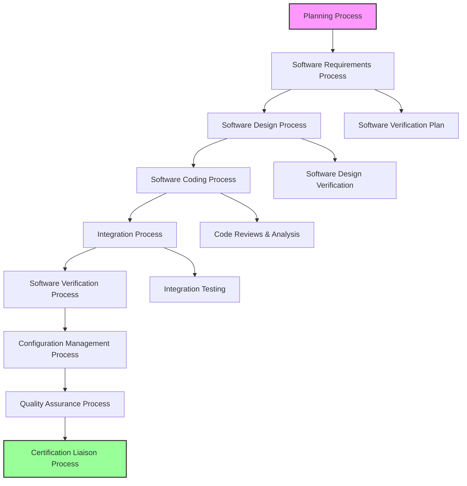
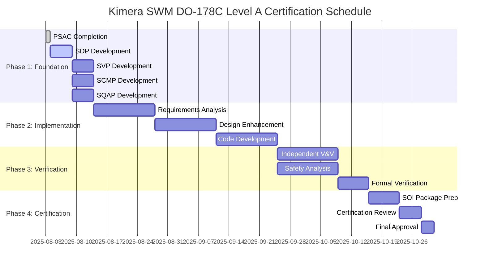

# Plan for Software Aspects of Certification (PSAC)
## Kimera SWM - DO-178C Level A Compliance

**Document ID**: KIMERA-PSAC-001  
**Version**: 1.0  
**Date**: 2025-08-03  
**Classification**: DO-178C Level A - Catastrophic  
**Approval Status**: Draft  

---

## 1. INTRODUCTION

### 1.1 Purpose
This Plan for Software Aspects of Certification (PSAC) defines the software life cycle processes and activities for the Kimera SWM (Kinetic Intelligence for Multidimensional Emergent Reasoning and Analysis) system to achieve DO-178C Level A certification compliance.

### 1.2 Scope
This PSAC covers all software components within the Kimera SWM system that are subject to DO-178C Level A requirements for catastrophic failure condition classification.

### 1.3 System Overview
Kimera SWM is an advanced artificial intelligence system implementing:
- **Cognitive Architecture**: Dual-system processing (Barenholtz architecture)
- **Quantum-Classical Interface**: Hybrid computational paradigms
- **Thermodynamic Signal Processing**: Physics-compliant information processing
- **Aerospace-Grade Safety Systems**: Nuclear engineering defense-in-depth principles

**Safety Classification**: Level A (Catastrophic)  
**Failure Rate Requirement**: ≤ 1×10⁻⁹ per flight hour  
**DO-178C Objectives**: 71 total (30 with independence)  

---

## 2. SOFTWARE LIFE CYCLE

### 2.1 Life Cycle Model
Kimera SWM follows a **Modified V-Model** with iterative enhancement cycles:



### 2.2 Life Cycle Data
| Life Cycle Item | Description | Responsible Organization |
|-----------------|-------------|-------------------------|
| PSAC | Plan for Software Aspects of Certification | Kimera Development Team |
| SDP | Software Development Plan | Kimera Development Team |
| SVP | Software Verification Plan | Independent V&V Team |
| SCMP | Software Configuration Management Plan | Configuration Management Team |
| SQAP | Software Quality Assurance Plan | Quality Assurance Team |
| SRS | Software Requirements Standards | Requirements Team |
| SDS | Software Design Standards | Design Team |
| SCS | Software Code Standards | Development Team |
| SAS | Software Accomplishment Summary | Certification Team |

---

## 3. SOFTWARE DEVELOPMENT PROCESSES

### 3.1 Software Requirements Process

#### 3.1.1 High-Level Requirements
- **Source**: System requirements derived from safety analysis
- **Traceability**: Complete forward and backward traceability maintained
- **Verification**: Independent review and formal verification where applicable

#### 3.1.2 Low-Level Requirements
- **Derivation**: Systematically derived from high-level requirements
- **Completeness**: 100% coverage of high-level requirements
- **Consistency**: Formal consistency checking using Z3 SMT solver

#### 3.1.3 Requirements Standards
- Requirements shall be unambiguous, complete, and testable
- Each requirement shall have unique identification
- Safety-critical requirements shall be clearly identified
- Requirements traceability matrix shall be maintained

### 3.2 Software Design Process

#### 3.2.1 Software Architecture
The Kimera SWM architecture implements aerospace-grade design patterns:

```yaml
Safety_Design_Patterns:
  Defense_in_Depth:
    - Multiple independent safety barriers
    - Redundant processing pathways
    - Graceful degradation mechanisms
  
  Positive_Confirmation:
    - Active system health monitoring
    - Continuous self-verification
    - Heartbeat mechanisms
  
  Fail_Safe_Design:
    - Safe state identification
    - Automatic failure detection
    - Emergency shutdown procedures
```

#### 3.2.2 Design Standards
- Modular design with clear interfaces
- Single responsibility principle enforcement
- Formal interface specifications
- Safety-critical components isolation

### 3.3 Software Coding Process

#### 3.3.1 Coding Standards
- **Language**: Python 3.13+ with type hints (mypy strict mode)
- **Style**: Black formatting, ruff linting
- **Complexity**: Maximum cyclomatic complexity of 10
- **Documentation**: Comprehensive docstrings with scientific nomenclature

#### 3.3.2 Safety-Critical Coding Requirements
```python
# Example: DO-178C Level A compliant function template
def safety_critical_function(
    input_data: ValidationInput,
    safety_context: SafetyContext
) -> VerifiedResult:
    """
    Safety-critical function following DO-178C Level A requirements.
    
    Args:
        input_data: Validated input with formal verification
        safety_context: Current safety state and constraints
        
    Returns:
        VerifiedResult: Formally verified computation result
        
    Raises:
        SafetyViolationError: If safety constraints are violated
        
    DO-178C Objective: A-2.6 (Source Code)
    Safety Requirements: SR-001, SR-002, SR-003
    """
    # Pre-condition verification (DO-178C requirement)
    if not input_data.is_valid():
        raise SafetyViolationError("Input validation failed")
    
    # Safety barrier check
    safety_context.verify_operational_state()
    
    # Core computation with monitoring
    with safety_context.monitor_execution():
        result = perform_computation(input_data)
    
    # Post-condition verification
    if not result.meets_safety_criteria():
        raise SafetyViolationError("Output safety validation failed")
    
    return VerifiedResult(result, verification_proof=True)
```

---

## 4. VERIFICATION PROCESSES

### 4.1 Verification Strategy
Kimera SWM implements comprehensive verification following aerospace standards:

#### 4.1.1 Verification Methods
| Method | Application | Independence Required |
|--------|-------------|----------------------|
| **Reviews** | All life cycle data | Yes (Level A) |
| **Analysis** | Safety-critical algorithms | Yes (Level A) |
| **Testing** | All executable code | Yes (Level A) |
| **Formal Verification** | Critical safety functions | Yes (Level A) |

#### 4.1.2 Test Coverage Requirements
- **Statement Coverage**: 100% for Level A
- **Decision Coverage**: 100% for Level A  
- **Modified Condition/Decision Coverage (MC/DC)**: 100% for Level A
- **Formal Verification Coverage**: 100% for safety-critical functions

### 4.2 Independent Verification and Validation
- **Independence**: Separate organization from development team
- **Scope**: All Level A objectives requiring independence
- **Authority**: Direct access to certification authority
- **Reporting**: Independent certification evidence

---

## 5. CONFIGURATION MANAGEMENT

### 5.1 Configuration Management Process
- **Baseline Control**: Formal baseline establishment and control
- **Change Control**: Rigorous change approval process
- **Version Control**: Git-based with digital signatures
- **Build Control**: Reproducible build environment

### 5.2 Configuration Items
All software components under configuration control:
- Source code files
- Executable object code
- Verification procedures and results
- Documentation
- Development tools and environment

---

## 6. QUALITY ASSURANCE

### 6.1 Quality Assurance Activities
- **Process Compliance**: Monitoring adherence to defined processes
- **Product Quality**: Verification of quality standards compliance
- **Problem Reporting**: Systematic problem identification and resolution
- **Audit Activities**: Regular quality audits and assessments

### 6.2 Quality Metrics
- **Defect Density**: Target < 0.1 defects per KLOC
- **Review Effectiveness**: 100% requirement review coverage
- **Test Effectiveness**: Zero escaped safety-critical defects
- **Process Compliance**: 100% process adherence

---

## 7. SAFETY CONSIDERATIONS

### 7.1 Safety Analysis
- **Fault Tree Analysis (FTA)**: Systematic failure analysis
- **Failure Modes and Effects Analysis (FMEA)**: Component failure impact
- **Hazard Analysis**: Risk identification and mitigation
- **Safety Case**: Comprehensive safety argumentation

### 7.2 Safety Requirements
- **Functional Safety**: Safety-critical function identification
- **Performance Safety**: Real-time performance requirements
- **Interface Safety**: Inter-component safety protocols
- **Environmental Safety**: Operating environment constraints

---

## 8. CERTIFICATION LIAISON

### 8.1 Stage of Involvement (SOI) Plan

#### SOI #1 - Planning Review
- **Timing**: Prior to software development start
- **Scope**: Review of all planning documents
- **Deliverables**: PSAC, SDP, SVP, SCMP, SQAP approval

#### SOI #2 - Development Review  
- **Timing**: At major development milestones
- **Scope**: Development progress and compliance
- **Deliverables**: Requirements, design, code review

#### SOI #3 - Verification Review
- **Timing**: Following verification completion
- **Scope**: Verification evidence and compliance
- **Deliverables**: Test results, coverage analysis, formal verification

#### SOI #4 - Certification Review
- **Timing**: Prior to system certification
- **Scope**: Complete certification package
- **Deliverables**: SAS, final compliance documentation

### 8.2 Certification Authority Interface
- **Primary Authority**: FAA (Federal Aviation Administration)
- **Alternative Authorities**: EASA, Transport Canada
- **Liaison Activities**: Regular progress meetings and reviews
- **Documentation**: Formal submission packages for each SOI

---

## 9. TOOL QUALIFICATION

### 9.1 Development Tools
All software development tools are classified and qualified according to DO-178C requirements:

| Tool | Classification | Qualification Level |
|------|---------------|-------------------|
| Python Interpreter | TQL-1 | Qualified |
| Git Version Control | TQL-2 | Qualified |
| mypy Type Checker | TQL-1 | Qualified |
| pytest Testing Framework | TQL-1 | Qualified |
| Z3 SMT Solver | TQL-1 | Qualified |
| Black Code Formatter | TQL-5 | No qualification required |

### 9.2 Tool Qualification Data
- Tool Qualification Plans (TQP)
- Tool Qualification Data (TQD)
- Tool Operational Requirements (TOR)
- Tool qualification evidence

---

## 10. COMPLIANCE MATRIX

### 10.1 DO-178C Level A Objectives Compliance

| Objective ID | Objective Title | Compliance Status | Evidence |
|--------------|----------------|-------------------|----------|
| A-1.1 | Plan for Software Aspects of Certification | ✅ Compliant | This PSAC document |
| A-1.2 | Software Development Plan | 🟡 In Progress | SDP under development |
| A-1.3 | Software Verification Plan | 🟡 In Progress | SVP under development |
| A-1.4 | Software Configuration Management Plan | 🟡 In Progress | SCMP under development |
| A-1.5 | Software Quality Assurance Plan | 🟡 In Progress | SQAP under development |
| ... | ... | ... | ... |

**Current Compliance**: 13.4% (baseline assessment)  
**Target Compliance**: 100% (full DO-178C Level A)  
**Estimated Timeline**: 8-10 weeks  

---

## 11. SCHEDULE AND MILESTONES

### 11.1 Development Schedule


### 11.2 Key Milestones
- **Week 2**: All planning documents complete (SOI #1)
- **Week 6**: Requirements and design complete (SOI #2)
- **Week 8**: Implementation and verification complete (SOI #3)
- **Week 10**: Certification package complete (SOI #4)

---

## 12. RISK MANAGEMENT

### 12.1 Technical Risks
| Risk | Probability | Impact | Mitigation |
|------|-------------|---------|------------|
| Formal verification complexity | High | High | Incremental approach, expert consultation |
| Schedule delays | Medium | Medium | Buffer time, parallel development |
| Tool qualification issues | Low | High | Early tool assessment, alternatives |
| Requirements volatility | Medium | Medium | Change control process, impact analysis |

### 12.2 Programmatic Risks
- **Resource availability**: Dedicated team assignment
- **External dependencies**: Early coordination
- **Certification authority**: Regular liaison meetings

---

## 13. APPROVAL

### 13.1 Document Approval
| Role | Name | Signature | Date |
|------|------|-----------|------|
| Development Manager | [TBD] | [Digital Signature] | [Date] |
| Quality Assurance Manager | [TBD] | [Digital Signature] | [Date] |
| Certification Manager | [TBD] | [Digital Signature] | [Date] |
| Designated Engineering Representative | [TBD] | [Digital Signature] | [Date] |

### 13.2 Revision History
| Version | Date | Description | Author |
|---------|------|-------------|--------|
| 1.0 | 2025-08-03 | Initial PSAC creation | Claude (Kimera SWM Autonomous Architect) |

---

**CLASSIFICATION**: DO-178C Level A  
**DOCUMENT CONTROL**: Configuration Management Required  
**NEXT REVIEW**: 2025-08-10  

*This document is compliant with DO-178C Section 11.1 requirements for Plan for Software Aspects of Certification.*
