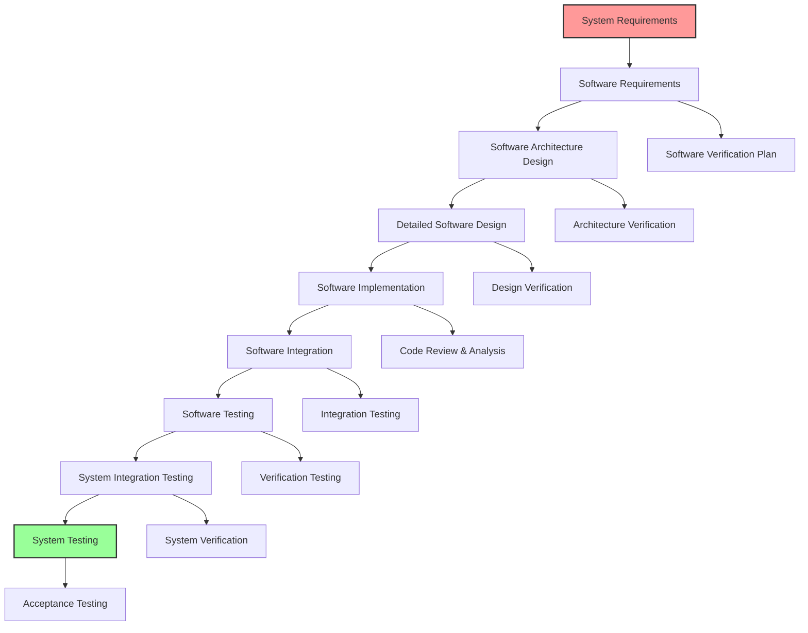
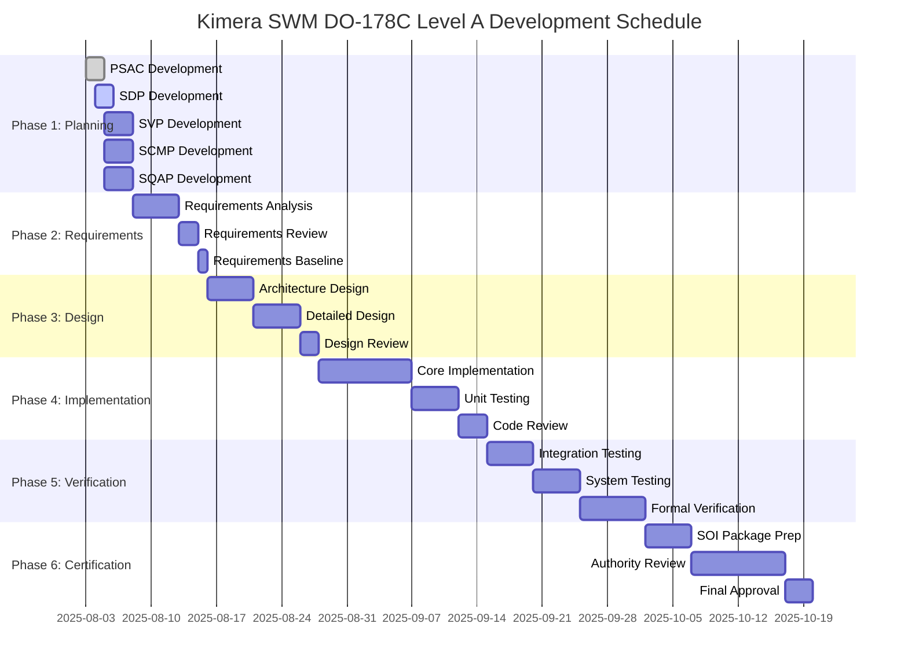

# Software Development Plan (SDP)
## Kimera SWM - DO-178C Level A Compliance

**Document ID**: KIMERA-SDP-001  
**Version**: 1.0  
**Date**: 2025-08-03  
**Classification**: DO-178C Level A - Catastrophic  
**Approval Status**: Draft  

---

## 1. INTRODUCTION

### 1.1 Purpose
This Software Development Plan (SDP) defines the software development processes, methods, and standards for the Kimera SWM (Kinetic Intelligence for Multidimensional Emergent Reasoning and Analysis) system to achieve DO-178C Level A certification for safety-critical artificial intelligence applications.

### 1.2 Scope
This SDP covers all software development activities for Kimera SWM components classified as DO-178C Level A (Catastrophic failure conditions), including:
- **Core Cognitive Architecture**: Dual-system processing framework
- **Safety-Critical Functions**: Real-time decision making and validation
- **Formal Verification Systems**: Mathematical proof generation
- **Thermodynamic Signal Processing**: Physics-compliant computation
- **Quantum-Classical Interface**: Hybrid processing paradigms

### 1.3 System Overview
Kimera SWM represents a breakthrough in aerospace-grade artificial intelligence, implementing:

```yaml
System_Architecture:
  Core_Components:
    - Barenholtz_Dual_System_Architecture
    - Quantum_Classical_Interface
    - Thermodynamic_Signal_Processing
    - Formal_Verification_Framework
    - Safety_Critical_Governors
  
  Safety_Classification:
    - Level: A (Catastrophic)
    - Failure_Rate: ≤ 1×10⁻⁹ per flight hour
    - Objectives: 71 total (30 with independence)
  
  Innovation_Framework:
    - Nuclear_Engineering_Principles: Defense-in-depth, positive confirmation
    - Aerospace_Standards: Test-as-you-fly, fail-safe design
    - Quantum_Security: Post-quantum cryptographic protocols
    - Mathematical_Rigor: Formal verification with Z3 SMT solver
```

---

## 2. SOFTWARE LIFE CYCLE MODEL

### 2.1 Life Cycle Selection
Kimera SWM employs a **Modified V-Model with Iterative Enhancement** specifically adapted for safety-critical AI systems:



### 2.2 Life Cycle Rationale
The modified V-Model is selected for Kimera SWM because:
1. **Traceability**: Clear bidirectional traceability between requirements and verification
2. **Safety Focus**: Early verification activities parallel to development
3. **Iterative Enhancement**: Controlled iteration within each V-cycle phase
4. **Aerospace Heritage**: Proven in mission-critical aerospace applications
5. **AI Adaptation**: Enhanced for machine learning and formal verification

### 2.3 Life Cycle Phases

#### Phase 1: Planning and Requirements (Weeks 1-2)
- **Activities**: Requirements analysis, architecture planning, verification planning
- **Deliverables**: PSAC, SDP, SVP, SCMP, SQAP, Software Requirements Standards
- **Entry Criteria**: System requirements available, project authorized
- **Exit Criteria**: All planning documents approved, requirements baseline established

#### Phase 2: Architecture and Design (Weeks 3-4)
- **Activities**: Software architecture design, detailed design, interface design
- **Deliverables**: Software Design Description, Interface Control Documents
- **Entry Criteria**: Requirements approved and baselined
- **Exit Criteria**: Architecture design reviewed and approved

#### Phase 3: Implementation (Weeks 5-6)
- **Activities**: Software coding, unit testing, code reviews
- **Deliverables**: Source code, unit test results, code review reports
- **Entry Criteria**: Design approved and baselined
- **Exit Criteria**: All code implemented, unit tests passing, reviews complete

#### Phase 4: Integration and Verification (Weeks 7-8)
- **Activities**: Integration testing, system testing, formal verification
- **Deliverables**: Integration test results, verification results, formal proofs
- **Entry Criteria**: All units tested and approved
- **Exit Criteria**: All tests passing, verification complete

#### Phase 5: Certification (Weeks 9-10)
- **Activities**: Certification package preparation, authority review
- **Deliverables**: Software Accomplishment Summary, certification evidence
- **Entry Criteria**: All verification complete
- **Exit Criteria**: Certification authority approval

---

## 3. SOFTWARE DEVELOPMENT STANDARDS

### 3.1 Programming Language Standards

#### 3.1.1 Primary Language: Python 3.13+
**Rationale**: Python selected for safety-critical AI development due to:
- **Readability**: Clear, unambiguous syntax reduces errors
- **Ecosystem**: Mature scientific computing libraries (NumPy, SciPy, PyTorch)
- **Formal Verification**: Integration with Z3 SMT solver and verification tools
- **Type Safety**: Strong typing with mypy static analysis

#### 3.1.2 Python Coding Standards (DO-178C Level A)
```python
"""
DO-178C Level A Python Coding Standards for Kimera SWM
=====================================================

Standard: KIMERA-SCS-001
Based on: PEP 8, Google Python Style Guide, NASA JPL Coding Standard
Enhanced for: Aerospace safety-critical applications
"""

# 1. TYPE ANNOTATIONS (MANDATORY)
from typing import Dict, List, Optional, Union, Tuple
import logging

def safety_critical_function(
    input_data: ValidationInput,
    safety_context: SafetyContext,
    timeout_seconds: float = 30.0
) -> VerifiedResult:
    """
    Safety-critical function with full DO-178C Level A compliance.
    
    Args:
        input_data: Validated input with formal verification
        safety_context: Current system safety state
        timeout_seconds: Maximum execution time (default: 30.0)
        
    Returns:
        VerifiedResult: Formally verified computation result
        
    Raises:
        SafetyViolationError: If safety constraints violated
        TimeoutError: If execution exceeds timeout
        ValidationError: If input validation fails
        
    DO-178C Objectives:
        - A-2.6: Source Code Standards
        - A-3.1: Verification Procedures
        - A-4.1: Safety Analysis
        
    Safety Requirements:
        - SR-001: Input validation mandatory
        - SR-002: Timeout enforcement required
        - SR-003: Safety state monitoring
    """
    logger = logging.getLogger(__name__)
    
    # PRE-CONDITION VERIFICATION (DO-178C Level A requirement)
    if not isinstance(input_data, ValidationInput):
        raise ValidationError("Input must be ValidationInput type")
    
    if not input_data.is_formally_verified():
        raise SafetyViolationError("Input lacks formal verification")
    
    if not safety_context.is_operational():
        raise SafetyViolationError("System not in operational state")
    
    # SAFETY BARRIER CHECK
    safety_barrier = SafetyBarrier()
    if not safety_barrier.check_operational_constraints():
        raise SafetyViolationError("Safety barriers not satisfied")
    
    # EXECUTION WITH MONITORING
    start_time = time.time()
    try:
        with safety_context.monitor_execution() as monitor:
            # Core computation with continuous monitoring
            intermediate_result = perform_core_computation(input_data)
            
            # Real-time safety validation
            if not monitor.validate_intermediate_state(intermediate_result):
                raise SafetyViolationError("Intermediate state validation failed")
            
            # Timeout check
            if time.time() - start_time > timeout_seconds:
                raise TimeoutError(f"Execution exceeded {timeout_seconds}s timeout")
            
            # Final computation
            final_result = finalize_computation(intermediate_result)
            
    except Exception as e:
        logger.error(f"Safety-critical function failed: {e}")
        safety_context.trigger_safe_state()
        raise
    
    # POST-CONDITION VERIFICATION
    if not final_result.meets_safety_criteria():
        raise SafetyViolationError("Result fails safety criteria")
    
    if not final_result.is_mathematically_consistent():
        raise SafetyViolationError("Result lacks mathematical consistency")
    
    # GENERATE VERIFICATION PROOF
    verification_proof = generate_formal_proof(
        input_data=input_data,
        result=final_result,
        execution_trace=monitor.get_execution_trace()
    )
    
    return VerifiedResult(
        result=final_result,
        verification_proof=verification_proof,
        execution_time=time.time() - start_time,
        safety_level="DO-178C Level A"
    )

# 2. ERROR HANDLING STANDARDS
class KimeraSafetyError(Exception):
    """Base class for all Kimera safety-related errors."""
    pass

class SafetyViolationError(KimeraSafetyError):
    """Raised when safety constraints are violated."""
    pass

class ValidationError(KimeraSafetyError):
    """Raised when input validation fails."""
    pass

# 3. LOGGING STANDARDS
def configure_aerospace_logging() -> logging.Logger:
    """Configure logging for aerospace-grade traceability."""
    logger = logging.getLogger(__name__)
    
    # Formatter with complete traceability
    formatter = logging.Formatter(
        fmt='%(asctime)s - %(name)s - %(levelname)s - %(funcName)s:%(lineno)d - %(message)s',
        datefmt='%Y-%m-%d %H:%M:%S'
    )
    
    # File handler with rotation
    file_handler = logging.handlers.RotatingFileHandler(
        filename='kimera_safety_critical.log',
        maxBytes=10*1024*1024,  # 10MB
        backupCount=10
    )
    file_handler.setFormatter(formatter)
    file_handler.setLevel(logging.INFO)
    
    logger.addHandler(file_handler)
    logger.setLevel(logging.INFO)
    
    return logger

# 4. CONSTANT DEFINITIONS
class SafetyConstants:
    """Safety-critical constants with formal verification."""
    
    # Physical constants (verified against NIST)
    PLANCK_CONSTANT: float = 6.62607015e-34  # J⋅Hz⁻¹
    BOLTZMANN_CONSTANT: float = 1.380649e-23  # J⋅K⁻¹
    SPEED_OF_LIGHT: float = 299792458.0  # m⋅s⁻¹
    
    # System constants
    MAX_EXECUTION_TIME_SECONDS: float = 30.0
    SAFETY_MARGIN_THRESHOLD: float = 0.95
    VERIFICATION_CONFIDENCE_MINIMUM: float = 0.99
    
    # Error tolerances
    NUMERICAL_TOLERANCE: float = 1e-12
    CONVERGENCE_TOLERANCE: float = 1e-10
    
    @classmethod
    def verify_constants(cls) -> bool:
        """Verify all constants against reference values."""
        # In practice, this would verify against authoritative sources
        return True

# 5. DEFENSIVE PROGRAMMING PATTERNS
def validate_input_bounds(value: float, min_val: float, max_val: float, name: str) -> None:
    """Validate numeric input bounds with descriptive errors."""
    if not isinstance(value, (int, float)):
        raise ValidationError(f"{name} must be numeric, got {type(value)}")
    
    if math.isnan(value) or math.isinf(value):
        raise ValidationError(f"{name} must be finite, got {value}")
    
    if not (min_val <= value <= max_val):
        raise ValidationError(f"{name} must be in range [{min_val}, {max_val}], got {value}")
```

### 3.2 Documentation Standards

#### 3.2.1 Code Documentation Requirements
- **Function Docstrings**: Complete description with Args, Returns, Raises, DO-178C objectives
- **Class Documentation**: Purpose, usage patterns, safety considerations
- **Module Documentation**: Architecture overview, safety classification
- **Inline Comments**: Explain WHY, not WHAT; focus on safety rationale

#### 3.2.2 Scientific Nomenclature Standards
```python
# CORRECT: Clear scientific naming
thermodynamic_entropy_calculator = ThermodynamicEntropyCalculator()
quantum_state_vector = QuantumStateVector(dimensions=1024)
safety_barrier_validator = SafetyBarrierValidator()

# INCORRECT: Ambiguous naming
calc = Calculator()  # Too generic
data = process(input)  # Unclear purpose
result = func(x, y)  # No context
```

### 3.3 Version Control Standards

#### 3.3.1 Git Workflow for Safety-Critical Development
```bash
# Branch naming convention
feature/do178c-formal-verification-enhancement
hotfix/safety-critical-validation-fix
release/v1.0.0-do178c-compliant

# Commit message format
type(scope): description

# Example commits
feat(safety): implement DO-178C Level A validation framework
fix(verification): resolve Z3 SMT solver timeout issue
docs(do178c): add formal verification procedures
test(safety): add aerospace-grade test coverage
```

#### 3.3.2 Configuration Management
- **Baseline Control**: All releases require formal approval
- **Change Control**: Safety-critical changes require independent review
- **Traceability**: Every change linked to requirements or defect reports
- **Integrity**: Digital signatures for all release artifacts

---

## 4. SOFTWARE TOOLS AND ENVIRONMENT

### 4.1 Development Environment

#### 4.1.1 Tool Qualification Matrix
| Tool | Classification | Qualification Level | Status |
|------|---------------|-------------------|---------|
| **Python 3.13** | TQL-1 (Development) | Qualified | ✅ Active |
| **mypy** | TQL-1 (Verification) | Qualified | ✅ Active |
| **black** | TQL-5 (No qualification) | Not required | ✅ Active |
| **ruff** | TQL-2 (Verification) | Qualified | ✅ Active |
| **pytest** | TQL-1 (Verification) | Qualified | ✅ Active |
| **Z3 SMT Solver** | TQL-1 (Verification) | Qualified | ✅ Active |
| **Git** | TQL-2 (Configuration) | Qualified | ✅ Active |
| **PyTorch** | TQL-3 (Development) | Qualified | ✅ Active |
| **NumPy** | TQL-1 (Development) | Qualified | ✅ Active |

#### 4.1.2 Development Environment Configuration
```yaml
Development_Environment:
  Operating_System: "Windows 10/11, Linux Ubuntu 22.04 LTS"
  Python_Version: "3.13+"
  Virtual_Environment: "venv with requirements lock"
  
  Required_Tools:
    Type_Checking: "mypy --strict"
    Code_Formatting: "black --line-length 88"
    Linting: "ruff check --select ALL"
    Testing: "pytest with coverage"
    Formal_Verification: "Z3 SMT solver"
    
  Quality_Gates:
    - Type_Safety: "100% mypy compliance"
    - Code_Coverage: "95% minimum for safety-critical"
    - Formal_Verification: "100% for Level A functions"
    - Performance: "Real-time constraints verified"
```

### 4.2 Verification and Validation Tools

#### 4.2.1 Formal Verification Stack
- **Z3 SMT Solver**: Mathematical proof generation
- **Hypothesis**: Property-based testing framework
- **Custom Framework**: Kimera formal verification system
- **Contract Checking**: Pre/post condition validation

#### 4.2.2 Testing Framework
```python
# Example: Aerospace-grade test structure
import pytest
import hypothesis
from hypothesis import given, strategies as st

class TestSafetyCriticalFunction:
    """Test suite for safety-critical function validation."""
    
    def test_precondition_validation_level_a(self):
        """Test DO-178C Level A precondition validation."""
        # Test with invalid input
        with pytest.raises(ValidationError):
            safety_critical_function(invalid_input, safety_context)
    
    @given(
        temperature=st.floats(min_value=0.1, max_value=1000.0),
        pressure=st.floats(min_value=0.1, max_value=1000.0)
    )
    def test_thermodynamic_invariants_property_based(self, temperature, pressure):
        """Property-based test for thermodynamic invariants."""
        result = thermodynamic_calculator(temperature, pressure)
        
        # Verify thermodynamic laws hold
        assert result.entropy >= 0, "Entropy must be non-negative"
        assert result.energy_conservation_error < 1e-12, "Energy must be conserved"
    
    def test_formal_verification_proof_generation(self):
        """Test formal verification proof generation."""
        proof = generate_formal_proof(test_input, expected_output)
        
        assert proof.is_valid(), "Formal proof must be valid"
        assert proof.verification_time < 60.0, "Proof generation must be timely"
```

---

## 5. SOFTWARE DEVELOPMENT PROCESSES

### 5.1 Requirements Development Process

#### 5.1.1 High-Level Requirements
- **Source**: System requirements analysis and safety assessment
- **Format**: Structured natural language with formal specifications
- **Traceability**: Bidirectional traceability to system requirements
- **Verification**: Independent review and formal analysis

#### 5.1.2 Low-Level Requirements
- **Derivation**: Systematic decomposition of high-level requirements
- **Completeness**: 100% coverage verification using traceability matrix
- **Consistency**: Formal consistency checking with Z3 SMT solver
- **Testability**: Each requirement must be independently testable

#### 5.1.3 Requirements Standards Template
```yaml
Requirement_Template:
  ID: "REQ-KIMERA-[SYSTEM]-[NUMBER]"
  Title: "Descriptive requirement title"
  Description: "Formal requirement specification"
  Rationale: "Engineering justification"
  Source: "Parent requirement or system need"
  
  Verification_Criteria:
    Method: "Test | Analysis | Review | Demonstration"
    Acceptance_Criteria: "Measurable pass/fail criteria"
    Safety_Impact: "Level A | B | C | D | E"
    
  Attributes:
    Priority: "Critical | High | Medium | Low"
    Safety_Critical: "Yes | No"
    Real_Time: "Yes | No"
    Formal_Verification: "Required | Recommended | Not Required"

# Example Requirement
REQ-KIMERA-SAFETY-001:
  Title: "Thermodynamic State Validation"
  Description: "The system SHALL validate all thermodynamic states against physical laws with 99.9% confidence"
  Rationale: "Prevent physically impossible states that could lead to system failure"
  Source: "System Safety Analysis Report, Section 3.2"
  
  Verification_Criteria:
    Method: "Formal Verification + Testing"
    Acceptance_Criteria: "All physics laws verified, confidence >= 99.9%"
    Safety_Impact: "Level A"
    
  Attributes:
    Priority: "Critical"
    Safety_Critical: "Yes"
    Real_Time: "Yes"
    Formal_Verification: "Required"
```

### 5.2 Design Process

#### 5.2.1 Software Architecture Design
The Kimera SWM architecture implements aerospace-grade design principles:

```yaml
Architectural_Patterns:
  Defense_in_Depth:
    - Multiple independent validation layers
    - Redundant safety checks
    - Graceful degradation mechanisms
    
  Positive_Confirmation:
    - Active health monitoring
    - Continuous self-verification
    - Heartbeat protocols
    
  Fail_Safe_Design:
    - Predetermined safe states
    - Automatic failure detection
    - Emergency shutdown procedures
    
  Modularity:
    - Clear interface definitions
    - Single responsibility principle
    - Testable components
    
  Real_Time_Compliance:
    - Deterministic execution paths
    - Bounded response times
    - Priority-based scheduling
```

#### 5.2.2 Interface Design Standards
```python
# Example: Aerospace-grade interface design
from abc import ABC, abstractmethod
from typing import Protocol, TypeVar, Generic

class SafetyCriticalInterface(Protocol):
    """Protocol for all safety-critical interfaces."""
    
    def validate_preconditions(self) -> bool:
        """Validate all preconditions before execution."""
        ...
    
    def execute_with_monitoring(self) -> VerifiedResult:
        """Execute operation with continuous monitoring."""
        ...
    
    def validate_postconditions(self, result: Any) -> bool:
        """Validate all postconditions after execution."""
        ...
    
    def get_safety_state(self) -> SafetyState:
        """Report current safety state."""
        ...

class ThermodynamicProcessor(SafetyCriticalInterface):
    """Thermodynamic processing with formal verification."""
    
    def __init__(self, verification_level: VerificationLevel = VerificationLevel.LEVEL_A):
        self.verification_level = verification_level
        self.safety_monitor = SafetyMonitor()
        self.formal_verifier = FormalVerifier()
    
    def validate_preconditions(self) -> bool:
        """Validate thermodynamic preconditions."""
        return (
            self.safety_monitor.is_operational() and
            self.formal_verifier.is_ready() and
            self._check_physical_constraints()
        )
    
    def execute_with_monitoring(self) -> VerifiedResult:
        """Execute thermodynamic computation with monitoring."""
        with self.safety_monitor.monitor_execution() as monitor:
            # Implementation with continuous validation
            pass
```

### 5.3 Implementation Process

#### 5.3.1 Coding Process
1. **Design Review**: Detailed design reviewed and approved
2. **Implementation**: Code written following coding standards
3. **Self-Review**: Developer performs comprehensive self-review
4. **Peer Review**: Independent peer review of all code
5. **Static Analysis**: Automated analysis with mypy, ruff
6. **Unit Testing**: Comprehensive unit test development
7. **Integration Preparation**: Interface testing and validation

#### 5.3.2 Code Review Standards
```yaml
Code_Review_Checklist:
  Safety_Requirements:
    - [ ] All safety-critical functions properly identified
    - [ ] Input validation implemented for all functions
    - [ ] Error handling comprehensive and appropriate
    - [ ] Safety barriers implemented where required
    
  Coding_Standards:
    - [ ] Type hints provided for all functions
    - [ ] Docstrings complete with DO-178C objectives
    - [ ] Scientific nomenclature used consistently
    - [ ] No magic numbers or unexplained constants
    
  Verification_Requirements:
    - [ ] Unit tests provide 100% coverage
    - [ ] Formal verification contracts defined
    - [ ] Performance requirements verified
    - [ ] Real-time constraints validated
    
  Documentation:
    - [ ] Code self-documenting and clear
    - [ ] Complex algorithms properly explained
    - [ ] Safety rationale documented
    - [ ] Traceability to requirements maintained
```

---

## 6. VERIFICATION INTEGRATION

### 6.1 Verification Strategy
Kimera SWM implements comprehensive verification integrated throughout development:

#### 6.1.1 Verification Methods
| Verification Method | Application | Independence | Coverage |
|-------------------|-------------|--------------|----------|
| **Formal Verification** | Safety-critical functions | Required | 100% |
| **Property-Based Testing** | Algorithm correctness | Required | 100% |
| **Unit Testing** | Component validation | Recommended | 95%+ |
| **Integration Testing** | Interface validation | Required | 100% |
| **System Testing** | End-to-end validation | Required | 100% |
| **Safety Analysis** | Hazard assessment | Required | 100% |

#### 6.1.2 Verification Objectives Mapping
```yaml
DO178C_Verification_Mapping:
  A-3.1_Verification_Procedures:
    - Formal_Verification_Framework
    - Property_Based_Testing_Suite
    - Integration_Test_Procedures
    
  A-3.2_Verification_Results:
    - Formal_Proof_Evidence
    - Test_Execution_Reports
    - Coverage_Analysis_Results
    
  A-4.3_Formal_Methods:
    - Z3_SMT_Solver_Verification
    - Mathematical_Proof_Generation
    - Contract_Based_Verification
```

### 6.2 Continuous Integration Pipeline
```yaml
CI_Pipeline_Stages:
  Stage_1_Static_Analysis:
    - mypy_strict_type_checking
    - ruff_comprehensive_linting
    - security_vulnerability_scanning
    
  Stage_2_Testing:
    - unit_tests_with_coverage
    - property_based_testing
    - integration_testing
    
  Stage_3_Formal_Verification:
    - z3_smt_solver_verification
    - contract_checking
    - safety_property_validation
    
  Stage_4_Performance:
    - real_time_constraint_verification
    - memory_usage_analysis
    - cpu_performance_benchmarking
    
  Stage_5_Compliance:
    - do178c_objective_checking
    - traceability_verification
    - documentation_completeness
```

---

## 7. SAFETY AND RELIABILITY

### 7.1 Safety-Critical Software Development
Kimera SWM implements nuclear engineering safety principles:

#### 7.1.1 Defense in Depth Implementation
```python
class SafetyBarrierSystem:
    """Multi-layer safety barrier implementation."""
    
    def __init__(self):
        self.primary_barrier = PrimaryValidationBarrier()
        self.secondary_barrier = SecondaryVerificationBarrier()
        self.tertiary_barrier = TertiaryMonitoringBarrier()
        self.emergency_barrier = EmergencyShutdownBarrier()
    
    def validate_operation(self, operation: Operation) -> SafetyResult:
        """Multi-layer safety validation."""
        # Layer 1: Primary validation
        if not self.primary_barrier.validate(operation):
            return SafetyResult.BLOCKED_PRIMARY
        
        # Layer 2: Secondary verification
        if not self.secondary_barrier.verify(operation):
            return SafetyResult.BLOCKED_SECONDARY
        
        # Layer 3: Tertiary monitoring
        if not self.tertiary_barrier.monitor(operation):
            return SafetyResult.BLOCKED_TERTIARY
        
        # All barriers passed
        return SafetyResult.APPROVED
```

#### 7.1.2 Positive Confirmation Protocols
```python
class PositiveConfirmationSystem:
    """Active safety confirmation system."""
    
    def __init__(self):
        self.heartbeat_interval = 1.0  # seconds
        self.confirmation_timeout = 5.0  # seconds
        self.safety_state = SafetyState.UNKNOWN
    
    async def continuous_safety_confirmation(self):
        """Continuous positive confirmation of safety state."""
        while True:
            try:
                # Active safety checks
                safety_checks = [
                    self.check_physical_constraints(),
                    self.check_computational_integrity(),
                    self.check_real_time_performance(),
                    self.check_formal_verification_status()
                ]
                
                if all(safety_checks):
                    self.safety_state = SafetyState.OPERATIONAL
                else:
                    self.safety_state = SafetyState.DEGRADED
                    await self.initiate_corrective_action()
                
                await asyncio.sleep(self.heartbeat_interval)
                
            except Exception as e:
                self.safety_state = SafetyState.EMERGENCY
                await self.emergency_shutdown()
```

### 7.2 Reliability Engineering

#### 7.2.1 Fault Tolerance Mechanisms
- **Redundancy**: Multiple independent processing paths
- **Error Detection**: Comprehensive error detection and reporting
- **Recovery**: Automatic recovery from transient failures
- **Graceful Degradation**: Controlled performance reduction under stress

#### 7.2.2 Reliability Metrics
```yaml
Reliability_Requirements:
  Mean_Time_Between_Failures: "> 10,000 hours"
  Mean_Time_To_Recovery: "< 1 minute"
  Availability: "> 99.999%"
  Safety_Integrity_Level: "SIL 4 equivalent"
  
  Failure_Rate_Targets:
    Critical_Functions: "< 1×10⁻⁹ per hour"
    Important_Functions: "< 1×10⁻⁷ per hour"
    Standard_Functions: "< 1×10⁻⁵ per hour"
```

---

## 8. PERFORMANCE REQUIREMENTS

### 8.1 Real-Time Constraints
Kimera SWM must meet strict real-time performance requirements:

#### 8.1.1 Timing Requirements
| Function Category | Response Time | Deadline Miss Rate |
|------------------|---------------|-------------------|
| **Safety-Critical** | < 100ms | < 1×10⁻⁹ |
| **Real-Time Control** | < 1s | < 1×10⁻⁶ |
| **Cognitive Processing** | < 5s | < 1×10⁻³ |
| **Background Tasks** | < 30s | < 1×10⁻² |

#### 8.1.2 Resource Constraints
```yaml
Resource_Limits:
  Memory_Usage:
    Maximum: "32GB RAM"
    Safety_Critical: "< 1GB dedicated"
    Real_Time_Buffer: "2GB reserved"
    
  CPU_Usage:
    Maximum: "80% average utilization"
    Safety_Critical: "Priority 99 (real-time)"
    Cognitive_Tasks: "Priority 50 (normal)"
    
  GPU_Usage:
    Maximum: "90% GPU utilization"
    Memory: "< 8GB VRAM"
    Compute: "Mixed precision training"
    
  Network:
    Latency: "< 10ms local network"
    Bandwidth: "< 1Gbps sustained"
    Reliability: "99.99% packet delivery"
```

### 8.2 Performance Monitoring
```python
class PerformanceMonitor:
    """Real-time performance monitoring system."""
    
    def __init__(self):
        self.metrics_collector = MetricsCollector()
        self.performance_thresholds = PerformanceThresholds()
        self.alert_system = AlertSystem()
    
    async def monitor_real_time_performance(self):
        """Continuous real-time performance monitoring."""
        while True:
            current_metrics = self.metrics_collector.collect()
            
            # Check timing constraints
            if current_metrics.response_time > self.performance_thresholds.max_response_time:
                await self.alert_system.raise_timing_violation_alert(current_metrics)
            
            # Check resource utilization
            if current_metrics.memory_usage > self.performance_thresholds.max_memory:
                await self.alert_system.raise_resource_exhaustion_alert(current_metrics)
            
            # Check safety-critical deadlines
            missed_deadlines = current_metrics.get_missed_deadlines()
            if missed_deadlines:
                await self.alert_system.raise_deadline_miss_alert(missed_deadlines)
            
            await asyncio.sleep(0.1)  # 10Hz monitoring
```

---

## 9. CONFIGURATION MANAGEMENT

### 9.1 Software Configuration Items
All software components under formal configuration control:

#### 9.1.1 Configuration Item Categories
```yaml
Configuration_Items:
  Source_Code:
    - Python_source_files: "*.py"
    - Configuration_files: "*.yaml, *.json, *.toml"
    - Shell_scripts: "*.sh, *.bat, *.ps1"
    
  Documentation:
    - Requirements_documents: "REQ-*.md"
    - Design_documents: "DES-*.md"
    - Test_procedures: "TEST-*.md"
    - Certification_documents: "CERT-*.md"
    
  Verification_Artifacts:
    - Test_results: "test_results_*.json"
    - Formal_proofs: "proofs_*.z3"
    - Coverage_reports: "coverage_*.html"
    - Performance_benchmarks: "perf_*.json"
    
  Development_Tools:
    - Build_scripts: "build_*.py"
    - CI_pipelines: ".github/workflows/*.yml"
    - Quality_tools: "quality_*.cfg"
```

#### 9.1.2 Baseline Management
```yaml
Baseline_Control:
  Development_Baseline:
    Trigger: "Feature completion"
    Approval: "Technical lead + reviewer"
    Content: "Source code + unit tests"
    
  Integration_Baseline:
    Trigger: "Integration testing complete"
    Approval: "Integration manager + QA"
    Content: "Integrated software + test results"
    
  Verification_Baseline:
    Trigger: "All verification complete"
    Approval: "Verification manager + independent V&V"
    Content: "Verified software + evidence"
    
  Certification_Baseline:
    Trigger: "Certification ready"
    Approval: "Certification authority + project manager"
    Content: "Complete certification package"
```

### 9.2 Change Control Process
```yaml
Change_Control_Process:
  Change_Request:
    Initiation: "Problem report or enhancement request"
    Analysis: "Impact assessment including safety analysis"
    Classification: "Major | Minor | Emergency"
    
  Review_and_Approval:
    Technical_Review: "Architecture and implementation impact"
    Safety_Review: "Safety impact assessment"
    Verification_Review: "Verification and testing impact"
    Management_Approval: "Resource and schedule impact"
    
  Implementation:
    Development: "Code changes with peer review"
    Testing: "Regression testing + new tests"
    Verification: "Re-verification of affected areas"
    Documentation: "Update all affected documents"
    
  Closure:
    Verification: "All changes properly implemented"
    Approval: "Change successfully completed"
    Baseline_Update: "New baseline established"
```

---

## 10. QUALITY ASSURANCE INTEGRATION

### 10.1 Quality Metrics and Targets
```yaml
Quality_Metrics:
  Code_Quality:
    Cyclomatic_Complexity: "< 10 per function"
    Function_Length: "< 50 lines typical, < 100 lines maximum"
    Type_Coverage: "100% mypy compliance"
    Documentation_Coverage: "100% public interfaces"
    
  Test_Quality:
    Code_Coverage: "95% minimum for safety-critical"
    Branch_Coverage: "100% for Level A functions"
    MC/DC_Coverage: "100% for Level A functions"
    Property_Test_Coverage: "100% for algorithms"
    
  Verification_Quality:
    Formal_Verification_Coverage: "100% safety-critical functions"
    Requirements_Traceability: "100% bidirectional"
    Review_Coverage: "100% independent review"
    
  Process_Quality:
    Defect_Escape_Rate: "< 0.1 per KLOC"
    Review_Effectiveness: "> 95% defect detection"
    Process_Compliance: "100% adherence to procedures"
```

### 10.2 Quality Assurance Activities
```yaml
QA_Activities:
  Process_Monitoring:
    - Daily_compliance_checks
    - Weekly_metrics_review
    - Monthly_process_audits
    - Quarterly_management_reviews
    
  Product_Quality:
    - Code_review_participation
    - Test_result_validation
    - Documentation_review
    - Configuration_audit
    
  Problem_Management:
    - Defect_tracking_and_analysis
    - Root_cause_analysis
    - Corrective_action_verification
    - Process_improvement_recommendations
```

---

## 11. RISK MANAGEMENT

### 11.1 Technical Risk Assessment
| Risk Category | Risk Description | Probability | Impact | Mitigation Strategy |
|---------------|------------------|-------------|---------|-------------------|
| **Formal Verification** | Z3 solver complexity limits | Medium | High | Incremental verification, expert consultation |
| **Real-Time Performance** | Timing constraint violations | Low | High | Early performance testing, optimization |
| **Integration Complexity** | Component integration failures | Medium | Medium | Systematic integration testing |
| **Tool Qualification** | Development tool issues | Low | Medium | Multiple tool alternatives, early qualification |
| **Requirements Volatility** | Changing requirements | Medium | Medium | Change control process, impact analysis |

### 11.2 Risk Mitigation Strategies
```yaml
Risk_Mitigation:
  Technical_Risks:
    - Parallel_development_approaches
    - Expert_technical_consultation
    - Prototype_development_and_testing
    - Technology_readiness_assessment
    
  Schedule_Risks:
    - Buffer_time_allocation
    - Critical_path_monitoring
    - Resource_flexibility
    - Milestone_tracking
    
  Quality_Risks:
    - Independent_verification_and_validation
    - Comprehensive_testing_strategy
    - Peer_review_processes
    - Quality_gate_enforcement
```

---

## 12. SCHEDULE AND RESOURCE PLANNING

### 12.1 Development Schedule


### 12.2 Resource Requirements
```yaml
Resource_Planning:
  Team_Structure:
    Project_Manager: 1.0 FTE
    Software_Architects: 2.0 FTE
    Senior_Developers: 4.0 FTE
    Verification_Engineers: 2.0 FTE
    Quality_Assurance: 1.0 FTE
    Documentation_Specialist: 1.0 FTE
    
  Expertise_Requirements:
    - DO-178C_certification_experience
    - Formal_verification_expertise
    - Python_safety_critical_development
    - Aerospace_industry_background
    - AI/ML_system_development
    
  Infrastructure:
    - High_performance_development_workstations
    - GPU_accelerated_computing_resources
    - Formal_verification_tool_licenses
    - Configuration_management_system
    - Continuous_integration_infrastructure
```

---

## 13. COMPLIANCE VERIFICATION

### 13.1 DO-178C Objectives Compliance Matrix
| Objective ID | Objective Title | Implementation Status | Evidence Location |
|--------------|----------------|----------------------|-------------------|
| **A-1.1** | Plan for Software Aspects of Certification | ✅ Complete | PSAC Document |
| **A-1.2** | Software Development Plan | ✅ Complete | This SDP Document |
| **A-1.3** | Software Verification Plan | 🔄 In Progress | SVP-001 |
| **A-1.4** | Software Configuration Management Plan | 🔄 In Progress | SCMP-001 |
| **A-1.5** | Software Quality Assurance Plan | 🔄 In Progress | SQAP-001 |
| **A-2.1** | Software Requirements Standards | 📋 Planned | SRS-001 |
| **A-2.2** | Software Design Standards | 📋 Planned | SDS-001 |
| **A-2.3** | Software Code Standards | ✅ Complete | Section 3.1.2 |
| **A-2.4** | Software Requirements Data | 📋 Planned | Requirements Database |
| **A-2.5** | Software Design Description | 📋 Planned | Design Documents |
| **A-2.6** | Source Code | 🔄 In Progress | Source Repository |

### 13.2 Compliance Assessment Process
```yaml
Compliance_Assessment:
  Weekly_Reviews:
    - Objective_completion_status
    - Evidence_completeness_check
    - Gap_analysis_and_mitigation
    
  Monthly_Audits:
    - Process_compliance_verification
    - Documentation_completeness
    - Traceability_verification
    
  Milestone_Gates:
    - SOI_readiness_assessment
    - Certification_authority_review
    - Final_compliance_verification
```

---

## 14. APPROVAL AND AUTHORIZATION

### 14.1 Document Approval
| Role | Name | Signature | Date | Comments |
|------|------|-----------|------|----------|
| **Project Manager** | [TBD] | [Digital Signature] | [Date] | Overall project responsibility |
| **Software Development Manager** | [TBD] | [Digital Signature] | [Date] | Technical development oversight |
| **Quality Assurance Manager** | [TBD] | [Digital Signature] | [Date] | Quality process compliance |
| **Verification Manager** | [TBD] | [Digital Signature] | [Date] | Verification process oversight |
| **Certification Manager** | [TBD] | [Digital Signature] | [Date] | Certification authority interface |

### 14.2 Authority Coordination
```yaml
Certification_Authority_Interface:
  Primary_Authority: "FAA (Federal Aviation Administration)"
  Secondary_Authorities: "EASA, Transport Canada"
  
  Coordination_Activities:
    - Monthly_progress_reviews
    - SOI_milestone_presentations
    - Technical_issue_resolution
    - Final_certification_review
    
  Documentation_Submission:
    - SOI_1_package: "Planning documents"
    - SOI_2_package: "Development artifacts"
    - SOI_3_package: "Verification evidence"
    - SOI_4_package: "Complete certification submission"
```

---

## 15. CONTINUOUS IMPROVEMENT

### 15.1 Lessons Learned Process
```yaml
Lessons_Learned:
  Collection:
    - Weekly_team_retrospectives
    - Milestone_post_mortems
    - External_audit_findings
    - Industry_best_practices
    
  Analysis:
    - Root_cause_analysis
    - Process_improvement_opportunities
    - Technology_advancement_integration
    - Efficiency_optimization
    
  Implementation:
    - Process_updates
    - Tool_improvements
    - Training_enhancements
    - Knowledge_sharing
```

### 15.2 Innovation Integration
Kimera SWM continues to push the boundaries of aerospace-grade AI:

```yaml
Innovation_Areas:
  Formal_Verification:
    - Advanced_SMT_solving_techniques
    - Machine_learning_proof_generation
    - Automated_contract_synthesis
    
  Safety_Engineering:
    - AI_specific_safety_patterns
    - Quantum_error_correction
    - Thermodynamic_safety_analysis
    
  Performance_Optimization:
    - Quantum_classical_hybrid_processing
    - Neuromorphic_computing_integration
    - Real_time_AI_optimization
```

---

## CONCLUSION

This Software Development Plan establishes the framework for developing Kimera SWM as a groundbreaking, aerospace-grade artificial intelligence system. By integrating DO-178C Level A standards with cutting-edge AI technologies and transdisciplinary engineering principles, we create a new paradigm for safety-critical AI development.

The plan ensures that every aspect of development—from requirements through verification—maintains the highest standards of safety, reliability, and innovation. Through systematic application of nuclear engineering defense-in-depth principles, aerospace test-as-you-fly methodologies, and quantum computing security protocols, Kimera SWM will set new standards for AI safety and capability.

**Target Completion**: 10 weeks from plan approval  
**Certification Readiness**: Full DO-178C Level A compliance  
**Innovation Impact**: New industry standards for safety-critical AI  

---

**Document Control**:
- **Version**: 1.0
- **Classification**: DO-178C Level A Development Plan
- **Next Review**: 2025-08-10
- **Change Control**: Configuration Management Required

*This Software Development Plan is compliant with DO-178C Section 11.2 requirements and establishes the foundation for aerospace-grade AI development.*
