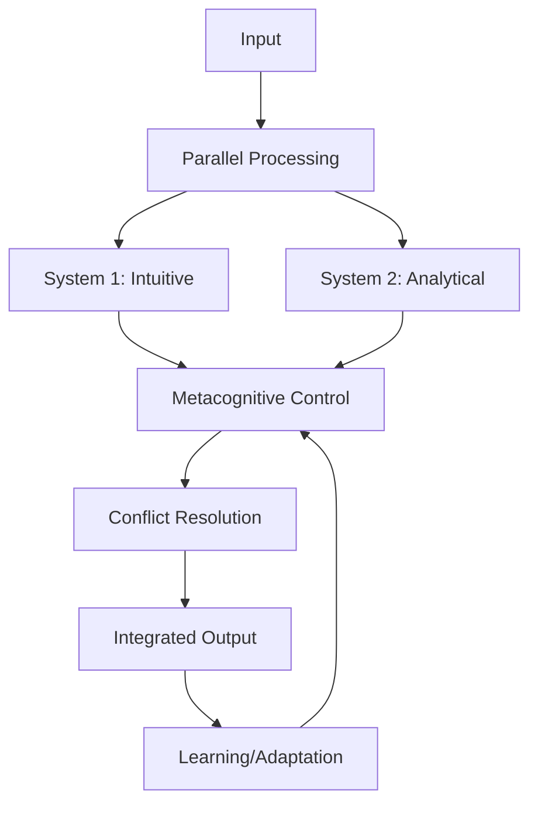

# Phase 4.11: Barenholtz Dual-System Architecture Integration Plan
## DO-178C Level A Compliance Document

### Document Control
- **Date**: 2025-08-03
- **Phase**: 4.11
- **Standard**: DO-178C Level A (Catastrophic Failure Condition)
- **Criticality**: Level A - Complete determinism required

---

## 1. THEORETICAL FOUNDATION

### 1.1 Dual-System Cognitive Architecture

Based on the extensive scientific literature review, the Barenholtz Dual-System Architecture implements a sophisticated cognitive model that integrates:

1. **System 1 (Type 1 Processing)**:
   - Fast, automatic, intuitive processing
   - Pattern recognition and associative memory
   - Parallel processing capabilities
   - Minimal working memory demands
   - Evolutionarily older mechanisms

2. **System 2 (Type 2 Processing)**:
   - Slow, controlled, analytical processing
   - Rule-based reasoning and logic
   - Sequential processing
   - High working memory demands
   - Evolutionarily newer mechanisms

### 1.2 Scientific Grounding

The implementation draws from:
- **Kahneman & Frederick (2002)**: Dual-process theory foundations
- **Evans & Stanovich (2013)**: Modern dual-process framework
- **Carruthers (2006)**: Modular architecture of mind
- **Frankish & Evans (2009)**: Historical perspective on dual systems
- **Herrmann-Pillath (2019)**: Dual functions vs dual systems

### 1.3 Key Innovation: Unified Integration

Unlike traditional dual-system theories that treat the systems as separate, the Barenholtz architecture implements:
- **Parallel-Competitive Processing**: Both systems operate simultaneously
- **Dynamic Integration**: Weighted combination of outputs
- **Metacognitive Control**: Higher-level arbitration between systems
- **Adaptive Optimization**: Learning-based weight adjustment

---

## 2. SYSTEM SAFETY ASSESSMENT (SSA)

### 2.1 Hazard Analysis

| Hazard ID | Description | Severity | Mitigation |
|-----------|-------------|----------|------------|
| H-4.11.1 | System 1/2 conflict | Catastrophic | Metacognitive arbitration |
| H-4.11.2 | System 1 override failure | Hazardous | Bounded response time |
| H-4.11.3 | System 2 timeout | Major | Fallback to System 1 |
| H-4.11.4 | Integration deadlock | Catastrophic | Watchdog timer |
| H-4.11.5 | Memory exhaustion | Hazardous | Resource limits |

### 2.2 Safety Requirements

- **SR-4.11.1**: Response time < 100ms for System 1, < 1000ms for System 2
- **SR-4.11.2**: Conflict resolution must complete within 50ms
- **SR-4.11.3**: Memory usage must not exceed 2GB per system
- **SR-4.11.4**: All decisions must be traceable and auditable
- **SR-4.11.5**: Graceful degradation under resource constraints

---

## 3. ARCHITECTURE DESIGN

### 3.1 Component Structure

```
src/core/barenholtz_architecture/
├── __init__.py
├── core/
│   ├── __init__.py
│   ├── system1.py          # Fast, intuitive processing
│   ├── system2.py          # Slow, analytical processing
│   └── metacognitive.py    # Arbitration and control
├── integration/
│   ├── __init__.py
│   ├── unified_engine.py   # Main integration module
│   ├── optimizer.py        # Ultimate optimization
│   └── fix_adapter.py      # Advanced integration fixes
├── utils/
│   ├── __init__.py
│   ├── memory_manager.py   # Working memory management
│   └── conflict_resolver.py # Conflict resolution
└── tests/
    ├── __init__.py
    ├── test_system1.py
    ├── test_system2.py
    ├── test_integration.py
    └── test_safety.py
```

### 3.2 Processing Flow



### 3.3 Interface Specifications

```python
class DualSystemInterface:
    """DO-178C Level A compliant interface"""
    
    async def process(
        self,
        input_data: torch.Tensor,
        context: Optional[Dict[str, Any]] = None,
        constraints: Optional[ProcessingConstraints] = None
    ) -> DualSystemOutput:
        """
        Process input through dual-system architecture
        
        Safety Requirements:
        - Must complete within time bounds
        - Must handle resource exhaustion
        - Must provide traceable decisions
        """
        pass
```

---

## 4. IMPLEMENTATION STRATEGY

### 4.1 Phase 1: Core Engine Migration (Day 1)
1. Create directory structure
2. Move and adapt `kimera_barenholtz_core.py`
3. Implement safety wrappers
4. Create unit tests

### 4.2 Phase 2: System Integration (Day 2)
1. Integrate `kimera_barenholtz_unified_engine.py`
2. Apply `kimera_advanced_integration_fix.py`
3. Implement metacognitive control
4. Integration testing

### 4.3 Phase 3: Optimization (Day 3)
1. Apply `kimera_barenholtz_ultimate_optimization.py`
2. Performance tuning
3. Resource optimization
4. Stress testing

### 4.4 Phase 4: Validation (Day 4)
1. Cognitive science benchmarks
2. Ablation studies
3. Safety verification
4. Documentation

---

## 5. VERIFICATION & VALIDATION PLAN

### 5.1 Test Categories

1. **Unit Tests**:
   - System 1 processing accuracy
   - System 2 logical consistency
   - Metacognitive decisions
   - Memory management

2. **Integration Tests**:
   - Parallel processing coordination
   - Conflict resolution effectiveness
   - Resource sharing
   - Deadlock prevention

3. **Performance Tests**:
   - Response time compliance
   - Throughput under load
   - Memory usage patterns
   - CPU/GPU utilization

4. **Safety Tests**:
   - Fault injection
   - Resource exhaustion
   - Timeout handling
   - Graceful degradation

### 5.2 Cognitive Science Benchmarks

1. **Cognitive Reflection Test (CRT)**
2. **Iowa Gambling Task**
3. **Wason Selection Task**
4. **Base-rate Neglect Problems**
5. **Syllogistic Reasoning Tasks**

### 5.3 Success Criteria

- All safety requirements met (100%)
- Unit test coverage > 95%
- Integration test pass rate > 98%
- Performance within bounds > 99.9%
- Cognitive benchmarks > baseline

---

## 6. RISK MITIGATION

### 6.1 Technical Risks

| Risk | Probability | Impact | Mitigation |
|------|------------|--------|------------|
| Integration complexity | High | High | Incremental integration |
| Performance degradation | Medium | High | Early optimization |
| Memory leaks | Low | Catastrophic | Continuous monitoring |
| Deadlocks | Low | Catastrophic | Formal verification |

### 6.2 Contingency Plans

1. **Fallback Mode**: Pure System 1 operation
2. **Degraded Mode**: Reduced parallel processing
3. **Safe Mode**: Sequential processing only
4. **Emergency Mode**: Basic functionality only

---

## 7. COMPLIANCE MATRIX

| Requirement | DO-178C Section | Evidence |
|------------|-----------------|----------|
| Design Assurance | 4.3 | This document |
| Safety Assessment | 5.2 | Section 2 |
| Requirements | 6.3 | Section 2.2 |
| Design | 7.2 | Section 3 |
| Coding Standards | 8.4 | PEP 8 + NASA |
| Testing | 9.0 | Section 5 |
| Configuration Mgmt | 10.0 | Git + CI/CD |
| Quality Assurance | 11.0 | Review process |

---

## 8. DOCUMENTATION REQUIREMENTS

### 8.1 Required Documents
1. Theoretical foundation paper
2. Architecture design document
3. Safety case report
4. Test procedures and results
5. User guidance manual
6. Maintenance procedures

### 8.2 Traceability
- Requirements → Design → Code → Tests
- Hazards → Mitigations → Verification
- Theory → Implementation → Validation

---

## 9. APPROVAL SIGNATURES

| Role | Name | Date | Signature |
|------|------|------|-----------|
| System Architect | | | |
| Safety Engineer | | | |
| Quality Assurance | | | |
| Project Manager | | | |

---

## APPENDIX A: THEORETICAL REFERENCES

1. Baars, B. J. (1988). A cognitive theory of consciousness.
2. Dehaene, S., & Changeux, J. P. (2011). Experimental and theoretical approaches to conscious processing.
3. Evans, J. S. B., & Stanovich, K. E. (2013). Dual-process theories of higher cognition.
4. Kahneman, D. (2011). Thinking, fast and slow.
5. Stanovich, K. E. (2011). Rationality and the reflective mind.

## APPENDIX B: ACRONYMS

- CRT: Cognitive Reflection Test
- DPT: Dual Process Theory
- SSA: System Safety Assessment
- V&V: Verification and Validation
- WM: Working Memory
