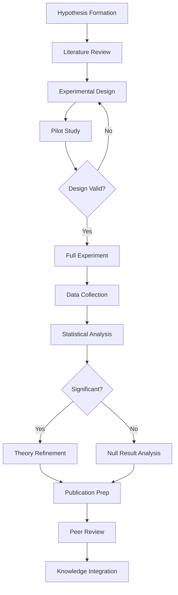

# RESEARCH EXPERIMENT PROMPT
## Scientific Experimentation Task

---

### OBJECTIVE
Design and execute research experiments following Kimera SWM Protocol v3.0 scientific rigor standards.

### PROCEDURE

#### 1. Core Research Protocol
```markdown
Design and execute research experiment:
1. Formalize hypothesis in mathematical notation
2. Identify all assumptions explicitly
3. Design controls and variables
4. Implement minimal test version
5. Collect comprehensive metrics
6. Analyze results statistically
7. Document insights and next steps
```

#### 2. Hypothesis Formulation

**Mathematical Notation Template**
```latex
H₀ (Null Hypothesis): μ₁ = μ₂
H₁ (Alternative Hypothesis): μ₁ ≠ μ₂

Where:
- μ₁ = Performance metric of baseline approach
- μ₂ = Performance metric of experimental approach
- α = 0.05 (significance level)
- β = 0.20 (Type II error rate)
- n = Sample size calculated for desired power
```

**Hypothesis Documentation Format**
```yaml
experiment:
  name: "Quantum-Inspired Cognitive State Transitions"
  hypothesis: |
    Implementing quantum superposition principles in cognitive state
    transitions will reduce computational complexity from O(n²) to O(n log n)
    while maintaining >95% accuracy in state prediction tasks.
    
  mathematical_formulation:
    baseline_complexity: "O(n²)"
    proposed_complexity: "O(n log n)"
    accuracy_constraint: "accuracy ≥ 0.95"
    
  testable_predictions:
    - "50% reduction in computation time for n > 1000"
    - "Memory usage scales linearly with state dimensions"
    - "Parallel speedup factor > 0.8 on 8-core systems"
```

#### 3. Experimental Design Framework

**Control Variables**
```python
class ExperimentalControls:
    """Maintain consistent experimental conditions"""
    
    FIXED_PARAMETERS = {
        'random_seed': 42,
        'dataset_version': 'v2.1',
        'hardware_config': {
            'gpu': 'NVIDIA RTX 3090',
            'cpu': 'AMD Ryzen 9 5900X',
            'ram': '64GB DDR4-3600'
        },
        'software_versions': {
            'python': '3.10.0',
            'torch': '2.0.1',
            'numpy': '1.24.3'
        }
    }
    
    @staticmethod
    def set_deterministic_mode():
        """Ensure reproducible results"""
        import random
        import numpy as np
        import torch
        
        random.seed(ExperimentalControls.FIXED_PARAMETERS['random_seed'])
        np.random.seed(ExperimentalControls.FIXED_PARAMETERS['random_seed'])
        torch.manual_seed(ExperimentalControls.FIXED_PARAMETERS['random_seed'])
        torch.backends.cudnn.deterministic = True
        torch.backends.cudnn.benchmark = False
```

**Variable Design**
```yaml
independent_variables:
  - name: "cognitive_state_dimensions"
    values: [64, 128, 256, 512, 1024]
    type: "discrete"
    
  - name: "superposition_coefficient"
    values: "np.linspace(0.0, 1.0, 21)"
    type: "continuous"
    
  - name: "entanglement_strength"
    values: ["none", "weak", "moderate", "strong"]
    type: "categorical"

dependent_variables:
  - name: "computation_time_ms"
    measurement: "wall clock time"
    precision: "microseconds"
    
  - name: "prediction_accuracy"
    measurement: "F1 score"
    precision: "4 decimal places"
    
  - name: "memory_usage_mb"
    measurement: "peak RSS"
    precision: "megabytes"
```

#### 4. Minimal Test Implementation

```python
class MinimalExperiment:
    """Minimal viable experiment implementation"""
    
    def __init__(self, hypothesis):
        self.hypothesis = hypothesis
        self.results = []
        
    def setup(self):
        """Prepare experimental environment"""
        # Create minimal dataset
        self.test_data = self.generate_minimal_dataset(n=100)
        
        # Initialize both approaches
        self.baseline_model = BaselineApproach()
        self.experimental_model = ExperimentalApproach()
        
        # Setup monitoring
        self.monitor = PerformanceMonitor()
        
    def run_single_trial(self, config):
        """Execute one experimental trial"""
        # Set configuration
        self.experimental_model.configure(config)
        
        # Run baseline
        self.monitor.start("baseline")
        baseline_result = self.baseline_model.process(self.test_data)
        baseline_metrics = self.monitor.stop("baseline")
        
        # Run experimental
        self.monitor.start("experimental")
        experimental_result = self.experimental_model.process(self.test_data)
        experimental_metrics = self.monitor.stop("experimental")
        
        # Calculate differences
        return {
            'config': config,
            'baseline': baseline_metrics,
            'experimental': experimental_metrics,
            'improvement': self.calculate_improvement(
                baseline_metrics, experimental_metrics
            )
        }
    
    def validate_results(self):
        """Ensure results meet scientific standards"""
        checks = {
            'reproducibility': self.check_reproducibility(),
            'statistical_significance': self.check_significance(),
            'effect_size': self.calculate_effect_size(),
            'assumptions_met': self.verify_assumptions()
        }
        return all(checks.values()), checks
```

#### 5. Data Collection Protocol

```python
class ComprehensiveDataCollector:
    """Collect all relevant experimental data"""
    
    def __init__(self, experiment_name):
        self.experiment_name = experiment_name
        self.timestamp = datetime.now().isoformat()
        self.data_dir = Path(f"experiments/{self.timestamp}_{experiment_name}")
        self.data_dir.mkdir(parents=True, exist_ok=True)
        
    def log_configuration(self, config):
        """Log complete experimental configuration"""
        config_data = {
            'timestamp': self.timestamp,
            'experiment': self.experiment_name,
            'environment': self.capture_environment(),
            'parameters': config,
            'git_commit': self.get_git_hash()
        }
        
        with open(self.data_dir / 'config.json', 'w') as f:
            json.dump(config_data, f, indent=2)
    
    def log_trial(self, trial_id, metrics):
        """Log individual trial results"""
        trial_file = self.data_dir / f'trial_{trial_id:04d}.json'
        
        trial_data = {
            'trial_id': trial_id,
            'timestamp': datetime.now().isoformat(),
            'metrics': metrics,
            'system_state': self.capture_system_state()
        }
        
        with open(trial_file, 'w') as f:
            json.dump(trial_data, f, indent=2)
    
    def log_continuous(self, metric_name, value, metadata=None):
        """Log continuous metrics during execution"""
        log_entry = {
            'timestamp': time.time(),
            'metric': metric_name,
            'value': value,
            'metadata': metadata or {}
        }
        
        # Append to continuous log
        with open(self.data_dir / 'continuous.jsonl', 'a') as f:
            f.write(json.dumps(log_entry) + '\n')
```

#### 6. Statistical Analysis Framework

```python
import scipy.stats as stats
import pandas as pd
import matplotlib.pyplot as plt
import seaborn as sns

class ExperimentalAnalysis:
    """Comprehensive statistical analysis of results"""
    
    def __init__(self, experiment_dir):
        self.experiment_dir = Path(experiment_dir)
        self.load_results()
        
    def load_results(self):
        """Load all experimental results"""
        trials = []
        for trial_file in self.experiment_dir.glob('trial_*.json'):
            with open(trial_file) as f:
                trials.append(json.load(f))
        
        self.df = pd.DataFrame(trials)
        
    def test_hypothesis(self, metric='computation_time'):
        """Perform hypothesis testing"""
        baseline = self.df[f'baseline_{metric}']
        experimental = self.df[f'experimental_{metric}']
        
        # Normality test
        _, p_norm_baseline = stats.normaltest(baseline)
        _, p_norm_experimental = stats.normaltest(experimental)
        
        if p_norm_baseline > 0.05 and p_norm_experimental > 0.05:
            # Use parametric test
            statistic, p_value = stats.ttest_rel(baseline, experimental)
            test_name = "Paired t-test"
        else:
            # Use non-parametric test
            statistic, p_value = stats.wilcoxon(baseline, experimental)
            test_name = "Wilcoxon signed-rank test"
        
        # Calculate effect size (Cohen's d)
        effect_size = (experimental.mean() - baseline.mean()) / baseline.std()
        
        return {
            'test': test_name,
            'statistic': statistic,
            'p_value': p_value,
            'effect_size': effect_size,
            'significant': p_value < 0.05
        }
    
    def generate_report(self):
        """Generate comprehensive analysis report"""
        report = {
            'summary_statistics': self.calculate_summary_stats(),
            'hypothesis_tests': self.run_all_hypothesis_tests(),
            'visualizations': self.create_visualizations(),
            'conclusions': self.draw_conclusions()
        }
        
        # Save report
        with open(self.experiment_dir / 'analysis_report.json', 'w') as f:
            json.dump(report, f, indent=2)
        
        # Generate markdown report
        self.generate_markdown_report(report)
```

#### 7. Insights Documentation

```markdown
# Experimental Insights Template

## Experiment: {name}
**Date**: {date}  
**Researcher**: {researcher}  
**Protocol Version**: Kimera SWM v3.0

### Key Findings

1. **Primary Result**: {main_finding}
   - Statistical significance: p = {p_value}
   - Effect size: d = {effect_size}
   - Practical impact: {interpretation}

2. **Unexpected Observations**:
   - {observation_1}
   - {observation_2}

3. **Limitations Discovered**:
   - {limitation_1}
   - {limitation_2}

### Theoretical Implications

{discussion_of_how_results_relate_to_theory}

### Next Steps

1. **Immediate Actions**:
   - [ ] {action_1}
   - [ ] {action_2}

2. **Future Experiments**:
   - {experiment_1}: {rationale}
   - {experiment_2}: {rationale}

3. **Required Resources**:
   - {resource_1}
   - {resource_2}

### Reproducibility Checklist

- [ ] Code committed to repository
- [ ] Data archived with checksums
- [ ] Environment snapshot saved
- [ ] Analysis scripts documented
- [ ] Results independently verified

### Peer Review Notes

{space_for_reviewer_comments}
```

### EXPERIMENT LIFECYCLE



### QUALITY ASSURANCE

1. **Pre-registration**: Register hypothesis before data collection
2. **Blinding**: Implement double-blind procedures where possible
3. **Power Analysis**: Ensure adequate sample size
4. **Replication**: Internal replication before claiming discovery
5. **Open Science**: Share data, code, and materials

---

*Remember: In science, negative results are as valuable as positive ones—they all contribute to our understanding of truth.* 